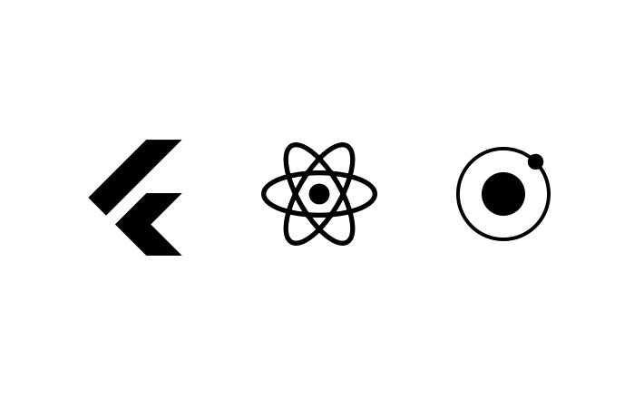
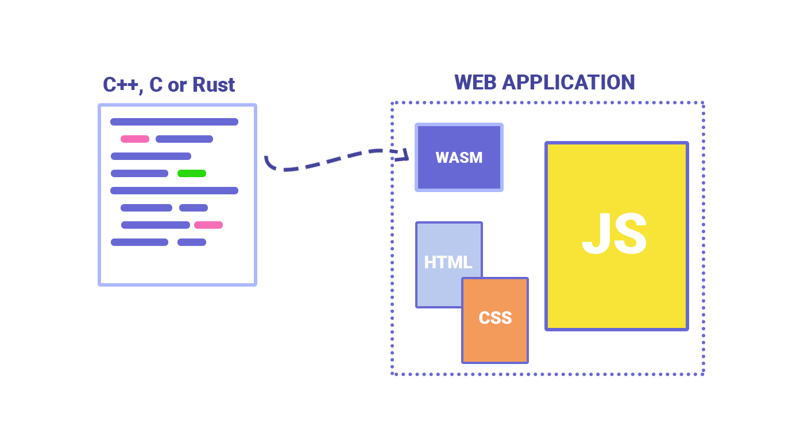

البرمجة مجال متجدد بشكل كبير جدا، وميدان تطوير الويب تحديدا متجدد ومتغير بوثيرة رهيبة. لذلك نجد العديد من المدونين والمطورين حول العالم في نهاية كل عام يتحدثون عن **حالة الويب** وتقنياته التي من المرتقب أن تشهد حضورا ونموا جيدا في السنة الجديدة.

بدوري قررت أن أكتب هذا المقال الذي سيكون طويلا نوعا ما ☕️ لأنني سأتحدث فيه عن جميع تقنيات وأدوات تطوير تطبيقات الويب التي من المتوقع أن تسمع عنها بشكل كبير في عام 2020.

هذا المقال ليس خريطة طريق أو مسارا لتعلم تطوير الويب، هذه ليست غايتي من ورائه. إنما الغرض هو أن تتشكل لدى القارئ والمتابع فكرة عن بيئة تطوير الويب وحزمة الأدوات التي تكون مجتمعة البنية التحتية لهذه البيئة الغنية.

الكثير من الأدوات التي سنتحدث عنها موجودة بالفعل ومستخدمة بشكل واسع منذ مدة، والبعض الآخر ربما تسمع عنه لأول.

على كل حال، اربط حزامك واستعد لسماع الكثير من المصطلحات التي ربما سيفوق عددها عدد سكان الهند 😃 🇮🇳

## لنبدأ بمحررات النصوص

عند التفكير في البرمجة عموما فإن أول ما يتبادر إلى الذهن تقريبا هي **محررات النصوص** أو Text Editors التي نكتب فيها الشفرة البرمجية، لأنها المكان الذي يقضي فيه المبرمج أو المطور جزءًا كبيرا من وقته.

قبل 3 سنوات من الآن، كان محرر Sublime Text هو الأكثر استخدام ومسيطرا على نسبة كبيرة من اختيارات مطوري الويب حول العالم. ولكن في العامين الأخيرين ظهر محرر جديد أكثر تطورا مع تجربة استخدام أفضل ومدعوم من طرف شركة عملاقة اسمها **مايكروسوفت**. بطبيعة الحال تعرفون الآن عما أتحدث 😉 نعم إنه محرر **Visual Studio Code** المعروع اختصارا ب VS Code، حيث أظهر استبيان جافاسكريبت الأخير عن كونه المحرر المفضل لما يزيد عن %56 من المشاركين في الإستبيان، متبوعا بمحرر **WebStorm** من شركة JetBrains ومحرر **Vim** مفتوح المصدر.


أما محرر **Sublime Text** فقد تراجع للمركز الرابع بنسبة استخدام لا تتجاوز 10% بعدما جاء في العام الماضي ثانيا أمام WebStorm و Vim اللذين تفوقا عليه في العام الحالي.

## أطر عمل CSS

CSS من القطع الأساسية التي لا يمكن الإستغناء عنها في الواجهات الأمامية لتطبيقات الويب. في كل عام لا بد أن تجد هذه اللغة في قائمة التقنيات والأدوات الأكثر استخداما في هذا المجال.

في التطبيقات الكبيرة والإحترافية يكون من الضروري في أحيان كثيرة الإستعانة بإطار عمل CSS لكي يسهل علينا إنشاء تصاميم تجاوبية ومتماسكة في جميع أجزائها وتفاصيلها. ويعتبر إطار العمل **Bootstrap** أشهر أطر عمل CSS وأكثرها استخداما من طرف مطوري الواجهات الأمامية (Frontend Developers). هذه المكانة المميزة اكتسبها وحافظ عليها Bootstrap منذ سنوات عديدة ومازال إلى اليوم موجودا ومنافسا بقوة.

إلى جانب **بوتستراب**، نجد أطر عمل أخرى جيدة بعضها قديم مثل **Zurb Foundation** والبعض الآخر يمكن اعتباره مستجدا مثل إطاري العمل **Bulma** و **Tailwind CSS**. هذا الأخير بالخصوص شهد صعودا مثيرا للإنتباه في العامين الأخيرين معتمدا على فلسفة خاصة في تصميم العناصر معروفة بطريقة "Utility classes". هذه الطريقة تعتمد على الإستخدام المكثف للكلاسات في عناصر HTML، كل كلاس مسؤول عن خاصية معينة في CSS، لذلك من العادي جدا عند استخدام Tailwind أن يظهر لدينا كود HTML بهذا الشكل:

```html
<form>
  <input
    class="bg-gray-200 hover:bg-white hover:border-gray-300 focus:outline-none focus:bg-white focus:shadow-outline focus:border-gray-300 ..."
  />
  <button
    class="bg-teal-500 hover:bg-teal-600 focus:outline-none focus:shadow-outline ..."
  >
    Sign Up
  </button>
</form>
```

هناك أطر عمل أخرى كثيرة ولكن حصصها صغيرة بالمقارنة مع ما ذكرناه. ليس عليك كمطور واجهات أمامية أن تكون على دراية كاملة بكل تلك الأطر، يكفي أن تختار واحدا منها وتفهم جيدا طريقة عمله لجعله خيارك الأول دائما في مشاريعك الإحترافية.

شخصيا أنا أستخدم **Bootstrap** منذ سنوات طويلة وإلى اليوم مازالت الأمور تسير على ما يرام معه 🙂

## جافاسكريبت واستمرار الثلاثة الكبار في السيطرة

لغة البرمجة جافاسكريبت، مثلها مثل لغة التنسيق CSS، تعتبر من الأعضاء الأساسية في جسد أي تطبيق ويب حديث. لذلك من الضروري على من يريد **تعلم تطوير واجهات الويب الأمامية** أن يتعلم أساسيات هذه اللغة واكتشاف أهم الوظائف والواجهات البرمجية التي توفرها مثل طريقة التعامل مع عناصر DOM أو ما يصطلح عليه ب **DOM Manipulation**، وكذلك تعلم استخدام واجهة **Fetch API** التي تمكننا من عمل طلبات Ajax بطريقة أسهل مما كان عليه الحال مع `XMLHttpRequest`.

من الضروري كذلك في 2020 أن يكون المطور ملما بشكل جيد بإصدار جافاسكريبت الحديث أو **ES6**، حيث أن العديد من خصائص هذا الإصدار أصبحت مدعومة أكثر فأكثر من طرف المتصفحات الكبيرة وفي مقدمتها **جوجل كروم** و**فايرفوكس**. حتى أنه لم يعد من الضروري في كثير من الحالات الإستعانة ب Babel [من أجل عملية Transpiling](/web-development/javascript/what-is-transpiling-javascript/).

### أطر عمل الواجهات الأمامية

فيما يخص أطر عمل جافاسكريبت فإن الكعكة مازالت مقسمة بشكل شبه كامل بين الثلاثة المعروفين: **رياكت، Vue.js و أنجولار**! هذا ما أكده كذلك استقساء [State Of JavaScript](https://2019.stateofjs.com/) لعام 2019 كما ترون في الصورة أسفله.


كل واحد من بين الثلاثة لديه مجتمع كبير من المطورين والمدافعين عنه، ومهما كان الخيار الذي تذهب معه فالأكيد أنه لن يكون خيارا سيئا مادام هنا طلب كاف على الكل في السوق.

إذن لا جديد يذكر تقريبا في موضوع أطر عمل جافاسكريبت في العام الذي نحن بصدد توديعه مقارنة بالعام الذي سبق، باستثناء ظهور مكتبة **Svelte** التي شهدت قبولا مثيرا للإهتمام من قِبل المطورين حول العالم. لم يسبق لي تجربة هذه المكتبة ولا فكرة لدي عن التغيير الذي جاءت به، ولكن ما لاحظته أن الكثير من الكلام الإيجابي دار حولها في الشهور الماضية وربما يكون العام الجديد هو عام صعود Svelte لمزاحمة الثلاثي المسيطر.

### اللغات المترجمة إلى جافاسكريبت (JavaScript Flavors)

منذ مدة ليست بالقصيرة ظهرت لغات برمجة كثيرة فوق جافاسكريبت بهدف إضافة مزايا ومقومات حديثة أثناء كتابة أكواد جافاسكريبت عوض انتظار لسنوات من أجل رؤية تلك المميزات تضاف بالفعل للغة البرمجة جافاسكريبت ودعمها من طرف المتصفحات.

كان أول تلك اللغات ظهورا وأشهرها في بدايات 2010 لغة **CoffeeScript**، ومن بعدها بسنوات ظهرت كل من **ClosureScript** ،**Typescript** و **Elm**. ولكن اليوم تعتبر Typescript - المطورة من طرف مايكروسوفت - هي الأكثر استخداما من طرف المطورين ومعظم أطر عمل جافاسكريبت تدعمها، بدءًا بأنجولار، ثم React.js وأخيرا Vue.js الذي من المنتظر أن يدعم هذه اللغة بشكل كامل في الإصدار 3 الذي ينتظره عشاق هذه المكتبة على أحر من الجمر.

المطورون ليسوا مجبرين على استخدام Typescript لكتابة أكواد React.js أو Vue.js، بل تعتبر تلك اللغة مجرد خيار ثان فقط لمن أراد الإستعانة بها والإستفادة من بعض المزايا التي لا يدعمها جافاسكريبت مثل **Type Checking** على وجه الخصوص.

> المتصفح لا يفهم سوى لغة **البرمجة** جافاسكريبت، وبالتالي فإن أكواد Typescript ومثيلاتها يتم ترجمتها إلى جافاسكريبت في مرحلة بناء الملفات المصدرية أو **Build time**. بتعبير آخر هي مجرد **منكهات** أو Flavors للغة JavaScript في مرحلة التطوير (Development) ولا نجد لها أي وجود أو أثر في وضعية الإنتاج (Production).

### أطر عمل Node.js

بالنسبة لأطر عمل Node.js فإن [إكسبريس](/web-development/javascript/what-is-expressjs/) مايزال في طليعتها ويأتي بعده كل من **Nest.js** ،**Koa** و **Meteor**. ونجد كذلك حضورا قويا لكل من **Next.js** و **Nuxt.js** الخاصين بعمل [Server Side Rendering](/web-development/javascript/what-is-server-side-rendering/) لتطبيقات React.js و Vue.js على التوالي، ولهما وجود قوي كذلك في مجال بناء المواقع الساكنة.

- قد يهمك أيضا: [أبرز أطر عمل Node.js لعام 2019](/web-development/javascript/most-popular-nodejs-web-frameworks/)

وعند ذكر **مولدات المواقع الساكنة** أو Static Site Generators فإن 2019 كان عام [Gatsby.js](/blogging/switching-from-wordpress-to-gatsbyjs/) بامتياز، ويتوقع أن يتواصل صعوده الصاروخي في العام الجديد ويكسب المزيد من ثقة مطوري الويب مستفيدا من شعبية React.js الكبيرة أصلا.

### مكتبات الفحص والإختبار (Unit Testing)


إجراء [اختبارات **Unit Testing**](/web-development/ما-هي-الإختبارات-البرمجية/) في مشاريع جافا سكريبت يصبع مطلوبا من طرف الشركات عاما بعد عام بشكل متنامٍ. وتعد مكتبة Jest الأكثر استخداما في عالم جافاسكريبت وخاصة في بيئتي React.js و Vue.js، بينما في بيئة أنجولار نجد حضورا قويا لإطار العمل **Jasmine** حيث يعمل الإثنان بتناغم وتوافقية ممتازين.

<NewsletterForm />

## لغات وأطر عمل النظم الخلفية


عند الحديث عن تطوير نظم الويب الخلفية فإنه لا يمكن تجاهل **لغة البرمجة PHP** خاصة في منطقة شمال افريقيا والشرق الأوسط. وعند الحديث عن أطر عمل PHP فإن **Laravel** وبعده **Symfony** من دون شك هما الأكثر شعبية والأكثر طلبا في سوق الشغل. والحديث الذي يدور من حين لآخر عن سوء PHP وعدم ملاءمتها لدعم التطبيقات المعقدة أظنه حديث وكلام مبالغ فيه، خاصة عندما يذهب بعضهم بعيدا بالقول أن [هذه اللغة في طريقها إلى الزوال والإندثار!](/web-development/php/php-market-share-expectations/)

كيف للغة برمجة تدعم أكثر من 80% من الشبكة العنكبوتية أن تزول بين عشية وضحاها ؟ وإذا سلمنا فرضا أن PHP غير ملائمة للمواقع والمنصات الكبيرة، فما هي أصلا نسبة المواقع والتطبيقات من هذا النوع في شبكة الويب ؟ لا أظن أنها تتجاوز 1% على أكثر تقدير. إذن PHP صالحة ل 99% المتبقية 😏 ألا يكفيها هذا ؟

بعد PHP تأتي لغات أخرى لها وجود لا يستهان به في السوق، أبرزها **بايثون** متمثلة في إطار عملها الأهم **Django** وكذلك لغة **روبي** وإطار العمل **Ruby on Rails** المعروف.

هذه تقريبا لغات البرمجة الثلاثة التي تسيطر على سوق **Backend Web Development**، ويمكن أن نضيف إليها كذلك **Java** التي نجد تواجدها مرتكز بالخصوص في التطبيقات الكبيرة مثل تطبيقات الأبناك وإدارة موارد الشركات، ومثل هذه التطبيقات كما هو معروف يتم إعطاؤها للشركات المتخصصة ولا حظ للمطورين المستقلين فيها في غالب الحالات.

### أنظمة إدارة المحتوى (CMS)

بالنسبة لأنظمة إدارة المحتوى فإن **ووردبريس** ككل عام هو المتسيد ومعه **دروبال** بطبيعة وكلاهما مبنيان على لغة PHP. الفرق أن مشاريع Wordpress تكون في العادة بسيطة وزهيدة السعر وبالتالي مناسبة للمبتدئين والمستقلين، بينما مشاريع Drupal تعتبر أكبر من حيث الحجم والقيمة المالية ويمكن كذلك أن تكون مناسبة للمستقلين ولكنها تتطلب مهارات أعلى في البرمجة وإدارة المشاريع.

## تطوير تطبيقات الموبايل باستخدام تقنيات الويب



منذ مدة أصبح بإمكان مطوري الويب بناء تطبيقات الهواتف الذكية باستخدام لغات وتقنيات الويب التي اعتادوا عليها. ومن أشهر وأهم أطر العمل التي توفر هذه الإمكانية نجد **React Native** من شركة فيسبوك و**Ionic** الذي يعرفه الجميع تقريبا كونه واحدا من أقدم أطر العمل من هذا النوع.

الفرق بينهما أن React Native يعتمد على React.js ويتيح لنا إمكانية بناء **واجهات رسومية أصيلة** (Native UI) بحسب نظام التشغيل الذي نقوم بناء التطبيق من أجله (أندرويد أو iOS). أما Ionic فهو يعتمد على **وضع التطبيق بكامله داخل Webview** - أو متصفح صغير - وبالتالي يمكننا استخدام HTML و CSS كما نفعل دائما عند بناء واجهات الويب الرسومية. هذا قد يعطي انطباعا لدى المستخدم بأنه في تطبيق غير أصلي أو **هجين**، ولهذا يعمل مطورو **أيونيك** جاهدين لتوفير أعداد كبيرة من المكونات (Components) الجاهزة والقريبة جدا من أصالة وكفاءة المكونات الأصلية.

إطار العمل Ionic يدعم إمكانية استخدام 3 من أطر عمل جافاسكريبت الرئيسية: Vue.js ،Angular وأخيرا رياكت.

جربت عمل تطبيق "أيونيك" مع React ولكن التجربة لم تكن كما هو مأمول منها حيث واجهت عدة مشاكل وأخطاء (Bugs) لأن دعم هذه المكتبة لم يمر عليه وقت طويل وبالتالي لم تصل هذه التوليفة إلى حالة الإستقرار المثالية.

لهذا أنصح هنا كل من يريد أن يبدأ في تعلم Ionic **الذهاب مع خيار Angular** لأنه الأقدم والأكثر استقرار، وكذلك ستجده مغطى بما يكفي من المقالات والموارد التعليمية عند البحث في جوجل أو يوتيوب.

هناك كذلك اسم ثالث دخل بقوة في المنافسة حول كعكة ما بات يعرف **بالتطوير العابر المنصات**، هذا الإسم ليس سوى **فلاتر** (Flutter) من شركة جوجل. ميزته أن لا يعتمد على جافاسكريبت ولا على أي من تقنيات الويب، بل على لغة برمجة اسمها دارت أو Dart صممتها شركة جوجل نفسها في عام 2011.

إذ شرط تعلم **لغة Dart** ضروري من أجل الإلتحاق بركب Flutter، هذا الركب الذي نمى كثيرا في العام الحالي وبتنا نسمع الكثير من الآراء الإيجابية والكلام الجميل حول هذه التقنية التي تستخدمها Google في عدد من مشاريعها مثل **Google Ads** و**Stadia**.

## تطبيقات الويب التقدمية (PWA)

تطور الويب بشكل هائل في العقد الأخير ومعه تطور سلوك المستخدمين تجاه تطبيقات الويب خاصة مع انتشار منصات التواصل الإجتماعي والقدرة على الوصول إلى الهدف والمعلومة بسرعة.

السرعة أصبحت من الأمور الحاسمة والهامة في تطبيقات الويب الحديثة، فإذا كان المستخدم لا يستطيع التفاعل مع موقعك أو تطبيقك فإنه سينصرف عنه وربما لا يعود إليه إطلاقا. لهذا تحاول الشركات والمنصات الإلكترونية الكبرى الإستثمار في هذا العامل الحاسم للحفاظ على مستخدميها وعملائها واكتساب آخرين.

فكرة **[تطبيقات الويب التقدمية](/web-development/what-is-progressive-web-applications/)** أو **Progressive Web Applications** جاء لتساعد مطوري الويب على بناء تطبيقات سريعة وتوفر تجربة استخدام قريبة من تلك التي نجدها في Native Applications مثل التوفر في حالة انقطاع الإتصال بالإنترنت وكذلك تحميلها لسطح المكتب سواء في الحواسب أو الأجهزة المحمولة.

> عربيا، أرى بأن [تطبيق أنا](https://ana.hsoub.com/) الذي أطلقته **شركة حسوب** قبل أيام هو أفضل مثال على ما يمكن أن نصل إليه مع تطبيقات Pwa. فإذا جربتم التطبيق فستلاحظون حتما بأنه يعمل بشكل جيد حتى في وضع عدم الإتصال بالإنترنت ويمكن إضافته لسطح المكتب كأي تطبيق أصلي آخر.

الفكرة التي نريد أن تصل هنا، أن هذا النوع من التطبيقات سيكون الطلب عليه متزايدا في العالم المقبل وسيكون من الجيد إذا تعلم مطور الويب أساسيات عمل مثل هذه التطبيقات والمعايير التي يجب احترامها للوصول بها إلى أعلى مستوى من الأداء والفعالية.

## ماذا عن Web Assembly ؟

سمعت عن **Web Assembly** منذ عامين أو ثلاثة ولكن لم يسبق لي أن كتبت عنه في توتومينا لأنه ما يزال في الفترات الأولى من حياته وما يزال استعماله محدودا جدا في تطوير الويب.

ببساطة **ويب أسامبلي** أو اختصارا WASM هو كود أو ترميز منخفض المستوى (Low-Level) يفهمه المتصفح وصمم ليكون بإمكان الأخير ـ أي المتصفح ـ تشغيل بعض البرامج التي تتطلب كفاءة وسرعة كبيرة مثل **ألعاب الفيديو** على سبيل المثال لا الحصر.

أكواد Web Asembly **لا يتم كتابتها من طرف المطور** بل ما يكتبه هو أكواد **C** ،**C++** أو **Rust**، ليتم تحويلها فيما بعد لأكواد وترميزات WASM قبل إعطائها للمتصفح.



يرى البعض بأن Web Assembly قد يأخذ مكان جافا سكريبت في المستقبل ولكن الحقيقة بحسب الكثير من المختصين غير ذلك، فهم يرون بأنه مجرد مكمل له وأن اتحاد الإثنان سيعطي قوة وإمكانيات أكبر للتطبيقات التي تشتغل داخل المتصفح.

> للمزيد من التفاصيل حول **ويب أسامبلي** زوروا [هذا الرابط لمقال ممتاز](https://blog.logrocket.com/webassembly-how-and-why-559b7f96cd71/) حول هذا الموضوع.

## أدوات أخرى

هناك الكثير من الأدوات الأخرى التي تدخل في روتين المطور اليومي مثل نظام التحكم في النسخ **Git** الذي أصبح تقريبا الخيار الأوحد لمطوري الويب حول العالم والمبرمجين بصفة عامة.

كذلك لا يجب أن ننسى برامج مثل **Docker** الذي يساعدنا في إنشاء، تشغيل ونشر مشاريع الويب عبر تحزيم كل التبعيات التي يحتاجها المشروع في ما يعرف بالحاويات أو Containers.

استخدام Docker **ليس ضروريا** ولكنه يصبح مطلوبا بشدة في المشاريع التي تعمل عليها فرق من المطورين وبالتالي ضرورة توحيد بيئة عمل وتشغيل التطبيق بينهم جميعا.

بالنسبة لي لم يسبق أن تعاملت مع هذا البرنامج في مشاريع حقيقية إلى أن التحقت بشركة حسوب في بدايات العام الحالي، حيث كان جزءًا مهما من سير العمل هناك.

## في الختام

هكذا إذن نكون قد رسمنا صورة لمشهد تطوير الويب اليوم، والعام الجديد سنرى بالتأكيد ظهور أسماء جديدة صاعدة، تراجع أسماء وتقنيات لحساب أخرى ولكن العمود الفقري ـ أي التقنيات الكبيرة ـ من المتوقع أن تظل راسخة وأن تتطور أكثر. فالتقنيات التي ظهرت من زمن طويل ونمت بمرور السنوات لا يمكن أن تتراجع بشكل كبير أو تختفي في ظرف عام واحد.

**ما رأيكم بالجرد الذي أجريته في هذا المقال ؟ هل ترون تقنيات كان يجدر بي الإشارة إليها ونسيتها أو غفلت عنها ؟ شاركوها معي، سأكون سعيدا جدا بأن نتبادل المنفعة.**

ادعموني كذلك بنشر هذه التدوينة ـ إذا أعجبتكم ـ في منصات التواصل التي تنشطون فيها 😉

#### مراجع مهمة

- [Web Development in 2020: What Coding Tools You Should Learn](https://www.freecodecamp.org/news/web-development-2020/)
- [All You Should Know About Web Development in 2020](https://blog.soshace.com/all-you-should-know-about-web-development/)

<Author slug="aissa" />
