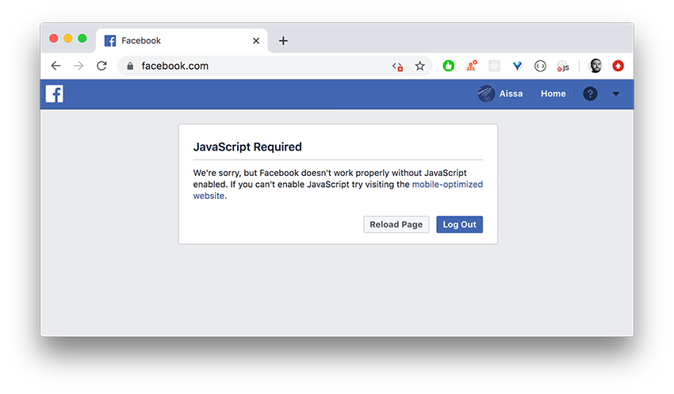
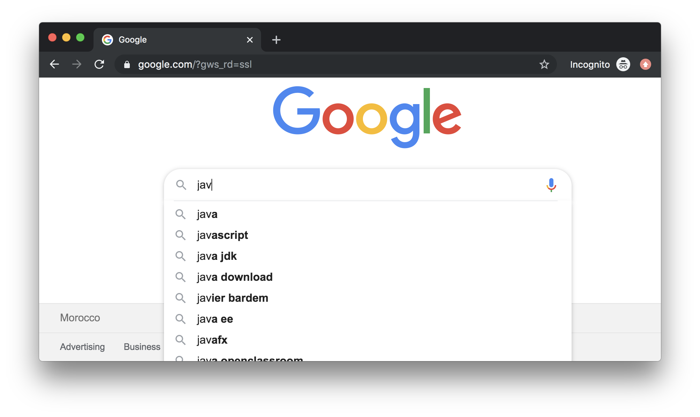
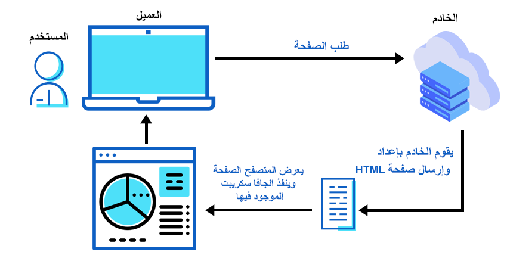
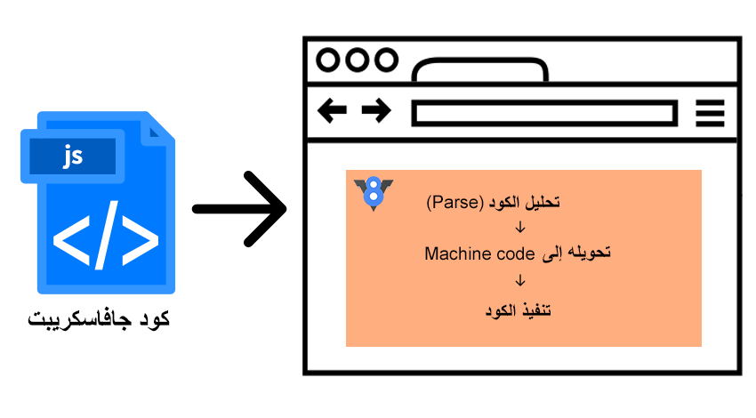

تطبيقات ومواقع الويب اليوم تعتمد أكثر من أي وقت مضى على **جافا سكريبت**، وبالتالي فإنه من الغير الممكن أن تتجاهل هذه اللغة إذا كنت تريد تعلم تطوير الويب اليوم.

تعتبر لغة البرمجة **JavaScript** - إلى جانب كل من HTML و CSS - العمود الفقري لأي صفحة ويب حديثة، وكل التطبيقات والمنصات الإلكترونية التي نعرفها وندخل إليها كل يوم تعتمد بشكل كبير جدا عليها، حتى أن موقع مثل فيسبوك لا يعمل عند تعطيلها.



إذن بما أنك دخلت إلى هذا الموضوع فلا شك بأنك على علم بأهمية لغة جافا سكريبت في مواقع الويب وتريد ربما البدء في تعلمها. وقبل البدء في تعلم أي لغة برمجة يستحسن أولا أن نعرف عن ماهيتها، كيفية اشتغالها وحدود صلاحياتها واستعمالاتها، وهذا بالضبط الهدف من هذا المقال الذي سيكون مقدمة وخطوة أولى لكل من يريد البدء في رحلة تعلم JavaScript والدخول في تفاصيلها.

## ما هي جافا سكريبت

جافا سكريبت هي لغة برمجة صممت في الأصل لإضافة مؤثرات وتفاعلات لصفحات الويب، ويعنى بالتفاعلات كل ما يتم عمله أو إجراؤه على مستوى المتصفح من دون الحاجة لإعادة تحميل الصفحة. نذكر على سبيل المثال:

- إخفاء أو إظهار عنصر HTML معين عند النقر على عنصر آخر.
- عمل وتحريك ما يعرف ب Sliders.
- إجراء عمليات أجاكس.
- التحقق من صحة البيانات في النماذج أو Form Validation.
- إلخ...

مثل هذه التفاعلات نلمسها بشكل يومي أثناء تعاملنا مع منصات ومواقع كبرى مثل جوجل وفيسبوك. فعندما يقوم الأول باقتراح كلمة أو جملة عندما نكتب له حرف أو حرفين فهو يقوم بذلك عن طريق جافا سكريبت، ولما ننزل في شريط أخبار فيسبوك ويتم إضافة مواد جديدة للشريط بشكل آلي كلما نزلنا فهو يستعين بجافا سكريبت للقيام بذلك، وقس عليه ما تجده وتراه كل يوم في المواقع التي تزورها.



نقول عن جافا سكريبت بأنه **لغة برمجة من جانب العميل** أو Client-side programming language لأنه يشتغل وينفذ في المتصفح بجهاز المستخدم، في مقابل لغات برمجة أخرى، مثل PHP، التي صممت لتعمل في ناحية الخادم Server-side.

من الضروري أن نفهما الفرق بين هذا النوعين من لغات البرمجة، فاللغات التي تشتغل في الخادم دورها هو إنشاء وبناء صفحات الويب التي يطلبها المستخدم وإرسالها إلى متصفح الأخير ليتم تنفيذ أكواد جافا سكريبت المضمنة فيها.



- للمزيد من التفاصيل: [دليل مفصل لكيفية عمل المواقع الإلكترونية](/web-developement/understand-web/)

## استعمالات JavaScript

بدأت لغة جافا سكريبت كما قلنا بكونها مجرد **Scripting Language** لإضافة بعض المؤثرات إلى صفحة الويب وبث الحياة فيها أكثر، ولكن اليوم توسع مجال اهتمامات هذه اللغة بشكل كبير جدا وشمل مجالات شتى، منها:

- **بناء تطبيقات الموبايل** وكذا تطبيقات سطح المكتب عن طريق تقنيات حديثة مثل [React Native](/web-development/javascript/مقدمة-عن-react-native/) ،[Ionic](/web-development/javascript/introduction-to-ionic2/) و [Electron](/web-development/javascript/electron-framework/).
- **تطوير ألعاب** تعمل داخل المتصفح، فالألعاب التي توفرها الآن على سبيل المثال شركة فيسبوك على موقعها والمعروفة ب **Instant Games** هي ألعاب أساسها جافا سكريبت. و**لعبة الديناصور** كذلك التي نلعبها رغم أننا لا نحبها على متصفح كروم عند انقطاع الإتصال بالإنترنت هي كذلك معتمدة على هذه اللغة.
- **تطوير النظم الخلفية** منذ الإعلان عن **Node.js** لأول مرة في عام 2009، هذا الإعلان من وجهة نظري كان بمثابة شهادة الميلاد الثالثة لجافا سكريبت بعد ميلاده الأول عام 1995 من طرف Brendan Eich وميلاده الثاني في عام 2004 مع دعم تقنية Ajax.

> موضوع ذات صلة: [من jQuery إلى React.js.. كيف ظهرت وتطورت أطر عمل جافاسكريبت ؟](/web-development/javascript/history-javascript-frontend-frameworks/)

## كيف يعمل جافاسكريبت

يشتغل الجافا سكريبت داخل المتصفح معتمدا على ما يعرف **بمحرك جافاسكريبت** أو JavaScript Engine. هذا الأخير يقوم بقراءة ترميزات جافاسكريبات وتحويلها لترميزات الآلة (Machine code) من أجل قراءتها وتنفيذها.

تتم هذه العملية بسرعة وكفاءة عالية بفضل تطور محركات جافاسكريبت في مختلف المتصفحات المعروفة التي أصبحت تعتمد على طريقة **JIT Compilation** في عملية تجميع وتحويل أكواد JavaScript إلى Machine code.

كان **محرك V8** من جوجل كروم هو السباق لتبني هذه الآلية بعد ظهوره لأول مرة في أواخر عام 2008، وتأثرت به بعد ذلك باقي المتصفحات وفي مقدمتها موزيلا فايرفوكس الذي سارع هو الآخر للإعتماد على Just-in-time Compilation في محركه **SpiderMonkey** للرفع من كفاءة وأداء تطبيقات الويب خصوصا وأن هذه التطبيقات شهدت في تلك الفترة تطورا نوعيا مع انتشار استخدام تقنية **أجاكس**.



يرجع الفضل كذلك لمحرك V8 في أننا اليوم نستطيع **تشغيل جافا سكريبت في الخوادم** حيث يشكل النواة الأساسية التي بني حولها [Node.js](/web-development/javascript/what-is-nodejs/).

## كيفية استخدام جافا سكريبت

البدء في استخدام جافا سكريبت سهل للغاية، يكفي إدراج الكود في صفحة الويب بإحدى الطريقتين التالتيين:

### الطريقة 1

هذه الطريقة تتمثل في إضافة ترميز الجافا سكريبت داخل وسم `<script>` بهذه الكيفية:

```html
<script>
  // كود جافا سكريبت هنا
</script>
```

### الطريقة 2

في هذه الطريقة نقوم بإنشاء ملف امتداده `.js` - مثلا `script.js` - ثم نستدعي هذا الملف داخل صفحة الويب :

```html
<script src="path/to/script.js"></script>
```

لاحظوا أننا قمنا بإضافة المسار نحو الملف `script.js` داخل الخاصية `src`.

تستخدم الطريقة الأولى في حال رغبنا بتضمين شيفرة جافا سكريبت بسيطة في صفحة معينة من الموقع دون غيرها، بينما نلجأ للطريقة الثانية في باقي الحالات.

> يمكن للمستخدم أن يقوم **بتعطيل جافا سكريبت** في متصفحه، جميع المتصفحات تتيح هذه الإمكانية. في هذه الحالة يجب عليك كصاحب موقع أن تضع في حسبانك إمكانية أن يكون جزء من المستخدمين قد عطلوا جافا سكريبت في متصفحاتهم. حينذاك يجب عليك إظهار رسالة تطلب فيها منهم **تفعيل JavaScript** إذا أرادوا التفاعل مع الموقع بشكل صحيح كما يفعل فيسبوك مثلا (لاحظ الصورة أعلاه). هذا الأخير يذهب أبعد من ذلك، حيث يوفر نسخة خفيفة من الموقع تعمل من دون جافاسكريبت وموجهة بشكل خاص لأجهزة الهواتف الذكية.

## أشياء لا يستطيع جافا سكريت في المتصفح القيام بها

هناك حدود يحاط بها الجافا سكريبت في المتصفح بحيث لا يستطيع تجاوزها، والهدف بكل تأكيد هو حماية بيانات وملفات المستخدمين من الوصول إليها من قبل بعض المواقع الشريرة. فعلى سبيل المثال:

- لا يمكن لأي موقع الوصول إلى الملفات في حاسوب المستخدم أو قراءتها إلا إذا قام المستخدم بنفسه برفع تلك الملفات إلى ذلك الموقع عن طريق عنصر File Input أو تقنية السحب والإفلات (Drag and Drop).
- حتى في داخل المتصفح الواحد، لا يمكن لجافاسكريبت في موقع مفتوح بتبويبة (Tab) أن يصل إلى محتويات موقع آخر في تبويبة ثانية.
- يمكن لجافاسكريبت أن يتواصل ويتبادل البيانات بشكل عادي وسهل مع خادم الموقع الذي قام بإرسال تلك الصفحة التي يشتغل فيها ذلك الجافا سكريبت، بينما يصبح هذا الأمر مقيدا إذا كانا الإثنان من أصول مختلفة. فمثلا لا يمكن لجافاسكريبت من مدونة توتومينا أن يرسل بيانات أو يحصل عليها من موقع آخر **إذا لم يسمح هذا الأخير بذلك**. هذه السياسية تعرف [Same-origin Policy](https://developer.mozilla.org/en-US/docs/Web/Security/Same-origin_policy) والهدف منها هو عزل أكواد جافا سكريبت الخبيثة في نطاق محدد لا تستطيع تجاوزه.

> هذه القيود غير موجودة بالنسبة لجافا سكريبت حين يشتغل **خارج المتصفح**، في الخوادم على سبيل المثال عن طريق Node.js.

## في الختام

بدأ **جافا سكريبت** صغيرا لا يعدو كونه لغة لإضافة بعض المؤثرات البصرية والتفاعلية لصفحات الويب. واليوم، وبعد 25 عاما تقريبا من ميلاده، أصبح يلعب أدوارا مهمة وأكثر تعقيدا في تطبيقات الويب الحديثة، بل أمسينا منذ وقت طويل نرى نفوذه [يصل لمجالات جديدة](/web-development/javascript/javascript-dominance/) ربما لم يكن يحلم بالوصول إليها في بداياته.

#### مراجع مهمة

- [An Introduction to JavaScript](https://javascript.info/intro)

<Author slug="aissa" />
