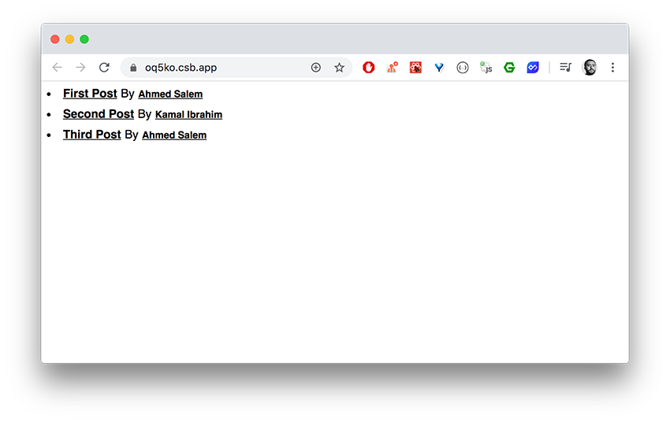
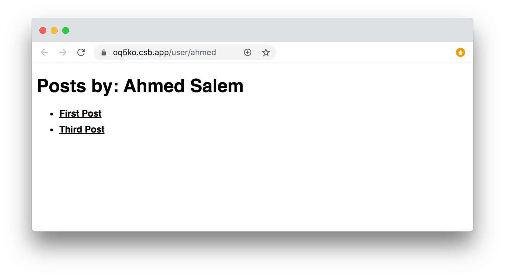

مكتبة React.js لا تأتي مع أي **نظام للتوجيه** أو ما يعرف ب Routing، لأنها أولا وقبل كل شيء مكتبة جافا سكريبت لبناء واجهات المستخدم (أو User Interface) وليست إطار عمل متكامل مثل أنجولار أو لارافيل على سبيل المثال.

لذلك توجد عدد من المكتبات المكملة لعمل React والتي تضيف إليها خصائص ومزايا جديدة، ومن بينها نجد مكتبة **React-Router** التي، كما هو واضح من اسمها، تمكن المطورين من التعامل بشكل سهل مع Routing في [تطبيقات الويب أحادية الصفحة](/web-development/javascript/what-is-single-page-application) المبنية على React.js.

## ما هو Router ؟

الموجه أو Router هو النظام الذي يمكن من قراءة الروابط لاستنتاج الصفحة أو المحتوى الذي سيتم عرضه للزائر أو المستخدم.

جميع أطر عمل تطبيقات الويب تتوفر على نظام للتوجيه لأنه من الأساسيات التي نحتاجها في أي تطبيق ويب مهما كان بسيطا.

## تثبيت react-router

أولا وقبل تثبيت `react-router` سنقوم بإنشاء مشروع [React.js](/web-development/javascript/react-javascript-library) باستخدام `create-react-app`.

```bash
npx create-react-app simple-blog
```

سنقوم بإنشاء مدونة بسيطة جدا.

في الصفحة الرئيسية سنعرض مجموع المقالات في المدونة، وعند النقر على عنوان المقالة سيتم توجيهنا إليها من أجل قراءتها. ويمكن كذلك النقر على اسم كاتب المقالة لكي نرى جميع المقالات التي قام بنشرها.

إذن في النهاية ستكون لدينا ثلاث مسارات:

- `/`: الصفحة الرئيسية.
- `/blog/:slug`: صفحة المقال.
- `/user/:slug`: صفحة الكاتب.

دعونا الآن نكمل عملنا في تثبيت وإعداد `react-router`.

```bash
npm install react-router-dom
```

هنا قمنا بتحميل مكتبة `react-router-dom`، وهي جزء `react-router` المكلف بالتعامل مع تطبيقات الويب، بينما `react-router-native` صممت [لتطبيقات React Native](/build-react-native-app-from-scratch) وهذا ليس موضوعنا اليوم في هذا المقال.

### الإعداد

نحن الآن في حاجة لربط مشروعنا بمكتبة `react-router-dom`.

الطريقة سهلة وبسيطة 😃

<div class="filename">index.js</div>

```jsx{3,9,11}
import React from 'react';
import ReactDOM from 'react-dom';
import { BrowserRouter } from 'react-router-dom';

import App from './App';

const rootElement = document.getElementById('root');
ReactDOM.render(
  <BrowserRouter>
    <App />
  </BrowserRouter>,
  rootElement
);
```

كل ما فعلناه هو استيراد المكون `BrowserRouter` ومن ثم أحطنا به المكون الرئيسي لتطبيقنا `<App />`.

## عودة لمثال المدونة

لن نستخدم أي Backend لجلب التدوينات والكُتاب، بل سنقوم فقط بجلبهما من مصفوفتين نقوم بإنشائهما وتصديرهما من الملف `data.js` الذي ننشئه في المجلد `src`.

<div class="filename">data.js</div>

```js
export const posts = [
  { slug: 'first-post', title: 'First Post', author: 'ahmed' },
  { slug: 'second-post', title: 'Second Post', author: 'kamal' },
  { slug: 'third-post', title: 'Third Post', author: 'ahmed' }
];
export const authors = [
  { slug: 'ahmed', name: 'Ahmed Salem' },
  { slug: 'kamal', name: 'Kamal Ibrahim' }
];
```

الصفحة الرئيسية كما قلنا سنعرض فيها روابط التدوينات وبجانب كل تدوينة نضع رابطا كذلك يؤدي لصفحة كاتب تلك المقالة.



## إنشاء الصفحة الرئيسية

لننشئ أولا المكون الذي سيمثل الصفحة الرئيسية للمدونة وذلك في ملف `HomePage.js` بالمجلد `src`.

<div class="filename">HomePage.js</div>

```jsx{2,10,12}
import React from 'react';
import { Link } from 'react-router-dom';

import { posts, authors } from './data';

export default function() {
  return posts.map(post => {
    return (
      <li key={post.slug}>
        <Link to={`/blog/${post.slug}`}>{post.title}</Link>
        <span style={{ margin: '0 5px' }}>By</span>
        <Link to={`/user/${post.author}`}>
          <small>
            {authors.find(author => author.slug === post.author).name}
          </small>
        </Link>
      </li>
    );
  });
}
```

### Link

أهم ما في هذا الكود هو استيراد المكون `Link` من مكتبة `react-router-dom`.

يمكننا `Link` من إنشاء رابط نحو صفحة معينة داخل التطبيق وذلك بفضل الخاصية `to`. هناك خصائص أخرى لهذا المكون ولكن لن نتطرق إليها في هذا الدرس.

> يمكنكم إلقاء نظرة في [التوثيق الرسمي](https://reacttraining.com/react-router/web/api/Link/) في حال أردتم مزيدا من المعلومات.

باقي الشفرة أظنها واضحة وغنية عن الشرح.

فقط قمنا بعرض المقالات الموجودة في المصفوفة `posts` وبجانب كل مقال اسم صاحبه.

### Route

الآن أنشأنا المكون `HomePage` ولكننا لم نستعمله بعد في أي مكان.

يجب علينا أن نقول لمكتبة React Router بأننا نريد عرض هذا المكون عندما يكون الرابط هو `/`.

لنفتح الملف `App.js` حيث المكون الرئيسي `<App />` ونضيف الكود التالي:

<div class="filename">App.js</div>

```jsx{2,10-12}
import React from 'react';
import { Route, Switch } from 'react-router-dom';
import HomePage from './HomePage';

import './styles.css';

export default function App() {
  return (
    <div className="App">
      <Switch>
        <Route exact path="/" component={HomePage} />
      </Switch>
    </div>
  );
}
```

هنا استعلمنا مكونين جديدين من سلسلة المكونات التي توفرها لنا مكتبة React Router، وهما: `<Switch>` و `<Route>`.

- `Route` هو المكون الذي يتولى عرض صفحة محددة (مكون `HomePage` في هذه الحالة) إذا تحقق شرط الرابط الموجود في الخاصية `path`. والخاصية `exact` نقول من خلالها ل React Router بأننا نعني بالضبط الرابط `/`، وإلا فإنه سيتم دائما عرض `HomePage` لأن جميع الروابط ستبدأ ب `/` 😃
- المكون `<Switch>` يضم بين ثناياه جميع مكونات `<Route />` **ويعرض أول مكون يتحقق فيه** الشرط الموجود في الخاصية `path`.

## صفحة المقالة

بنفس الطريقة، سنقوم بإنشاء مكون `PostPage` في ملف `PostPage.js`. هذا المكون سيكون المعني بعرض الصفحة حيث تفاصيل المقالة. في هذا المثال سنكتفي بالعنوان فقط.

<div class="filename">PostPage.js</div>

```jsx{2,7}
import React from 'react';
import { useParams } from 'react-router-dom';
import { posts } from './data';

export default function() {
  const [post, setPost] = React.useState({});
  const { slug } = useParams();

  React.useEffect(() => {
    const current = posts.find(post => post.slug === slug);
    setPost(current);
  }, [slug]);

  return <h1>{post.title}</h1>;
}
```

كلمة السر في الكود أعلاه هي الدالة `useParams()`، وهي كما تلاحظون تلعب هنا دور Hook نتمكن بواسطته من استرجاع قيمة البارامتر `slug` الذي يتم تمريره عبر URL.

بواسطة هذا البارامتر سنستطيع طلب وجلب المقالة المناسبة.

```terminal
/blog/:slug
```

## صفحة الكاتب

أظن الآن أنك تستطيع عمل صفحة الكاتب لوحدك 😃

هيا حاول منفردا ولا تعد لإكمال هذا الدرس إلا بعد أن تنهي تلك الصفحة ⏱

<div class="filename">AuthorPage.js</div>

```jsx
import React from 'react';
import { useParams, Link } from 'react-router-dom';
import { posts, authors } from './data';

export default function() {
  const [author, setAuthor] = React.useState({});
  const [authorPosts, setAuthorPosts] = React.useState([]);
  const { slug } = useParams();

  React.useEffect(() => {
    const currentAuthor = authors.find(author => author.slug === slug);
    const currentAuthorPosts = posts.filter(post => post.author === slug);

    setAuthor(currentAuthor);
    setAuthorPosts(currentAuthorPosts);
  }, [slug]);

  return (
    <>
      <h1>Posts by: {author.name}</h1>
      <ul>
        {authorPosts.map(post => (
          <li key={post.slug}>
            <Link to={`/blog/${post.slug}`}>{post.title}</Link>
          </li>
        ))}
      </ul>
    </>
  );
}
```

النتيجة هي كالتالي:



إلى هنا يكون مثال المدونة قد انتهى، ويمكنكم رؤية الكود كاملا من خلال [هذا الرابط](https://github.com/aissa-bouguern/testing-react-router/).

## NavLink

في القائمة الرئيسية للموقع نحتاج في العادة لكي نضيف كلاس معين (`active` مثلا) إلى أحد عناصر القائمة لكي يعرف الزائر في أي صفحة أو في أي قسم من الموقع هو الآن. المكون `<Link />` لا يسمح بإضافة هذا الخاصية ولذلك توفر مكتبة `react-router-dom` مكونا آخر يؤدي نفس الدور تقريبا ولكنه يتلاءم بشكل أساسي مع القوائم (Navigations/Menus).

هذا المكون هو `<NavLink />` ويستعمل بنفس طريقة استعمال `<Link />` إلا أنه يقبل الخاصية `activeClassName` لإخباره عن الكلاس الذي سيضاف للرابط.

```jsx
<NavLink exact activeClassName="active" to="/">
  Home
</NavLink>
```

## التوجيه برمجيا

في أحيان كثيرة نحتاج لتوجيه المستخدم إلى صفحة معينة بشكل برمجي وليس عن طريق المكون `<Link />`.

مثلا عندما يقوم بتسجيل الدخول أو الخروج نوجهه مباشرة إلى لوحة التحكم أو الصفحة الرئيسية.

الطريقة بسيطة وتتم عن طريق `useHistory()` كما في هذا المثال:

```jsx{2,9}
function AuthButton() {
  let history = useHistory();

  return fakeAuth.isAuthenticated ? (
    <p>
      Welcome!
      <button
        onClick={() => {
          fakeAuth.signout(() => history.push('/'));
        }}
      >
        Sign out
      </button>
    </p>
  ) : (
    <p>You are not logged in.</p>
  );
}
```

## في الختام

هكذا نكون قد مررنا على مجموعة من المزايا التي توفرها لنا حزمة React Router للتنقل بين الصفحات في تطبيقات React.js.

للإطلاع على باقي المميزات والخصائص أدعوكم لزيارة [التوثيق الرسمي للمكتبة](https://reacttraining.com/react-router/web/guides/quick-start) ومتابعة الأمثلة الواردة فيه.

<Author slug="aissa" />
