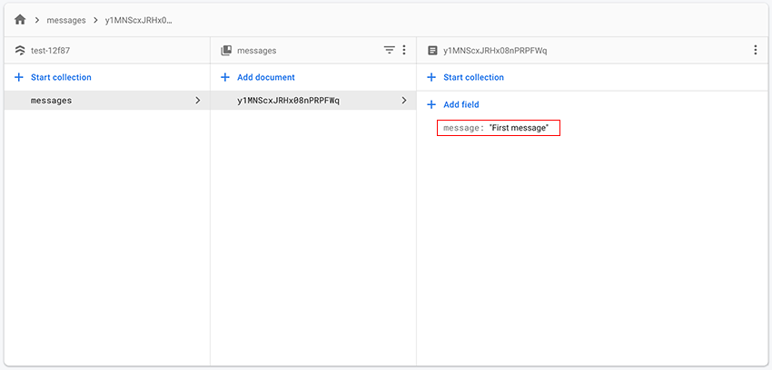
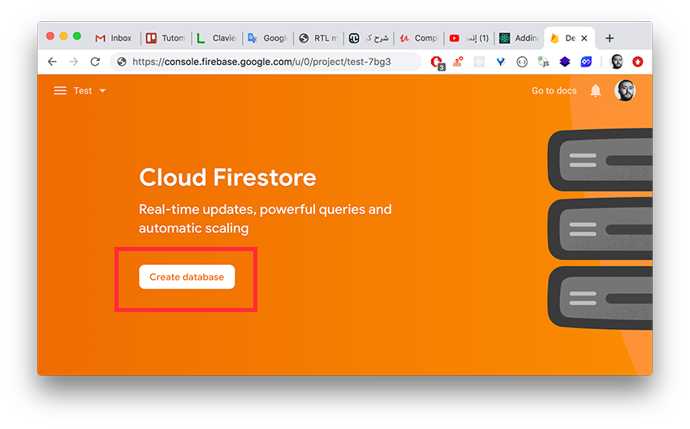

يشكل كل من **فايربيز** (Firebase) و مكتبة React ثنائية رائعة لبناء تطبيقات ويب عصرية، آمنة وقابلة للتوسع والتطوير (Scalable). ولقد تكلمنا في [مقال سابق](/web-development/firebase/) بشيء من التفصيل عن Firebase وأهم المميزات والأدوات التي يوفرها للمطورين لإنجاز تطبيقات ومشاريع مدعومة ببنية تحتية خلفية قوية ومتطورة.

في هذا الدرس سنتعلم معا الطريقة الصحيحة **لإضافة خدمة فايربيز إلى مشروع رياكت** وذلك بالإعتماد على **Context API** و [React Hooks](/web-development/javascript/introduction-react-hooks/).

## شرح Context API في React.js

توفر [مكتبة React](/web-development/javascript/react-javascript-library) واجهة Context API لتمكين المطورين من الوصول إلى الحالة (State) أو أي متغير من أي مكان داخل سياق (Context) معين، ولذلك سميت ب Context API.

تتألف هذه الواجهة من جزءين أساسيين:

- `Provider`: كما هو واضح من اسمه، يتولى هذا الجزء مهمة **تمويننا** بالحالة أو المعلومة التي نريد الوصول إليها.
- `Consumer`: هذا الجزء يمكننا من **استهلاك** تلك المعلومات في مكان يدخل ضمن دائرة نفوذ **الممون** (Provider) الموافق له.

تلعب Context API دورا يمكننا من التخلص من مشكل **Props Drilling** الذي يبدأ في الظهور كلما أردنا تمرير حالة معينة من **مكون أب** إلى **أحد أحفاذه**. فكلما زاد بعد الحفيذ عن المكون الأب زادت عدد المكونات الوسيطة بينهما التي تستقبل تلك الحالة كخاصية (Prop) وتقوم بتمريرها بدورها لأحد أبنائها، وهكذا حتى نصل للمكون الحفيذ الذي يحتاج لتلك الخاصية.

كل هذه المكونات الوسيطة التي استقبلت ال Prop وأعادت تمريرها نحو الأسفل هي في الحقيقة **ليست في حاجة إليها** وإنما لعبت فقط دور الممرر، وهذا ما يعرف بمشكل **Props Drilling**، وإنما جاءت Context API لحل هذا المشكل وجعل الوصول لأي حالة أو معلومة متاحا مباشرة **في المكان الذي نحتاجها فيه بالضبط**.

## إنشاء FirebaseContext

بعدما تعرفنا على Context API وفائدتها، سنمر الآن إلى تطبيق ما تحدثنا عنه بشكل عملي.

أولا وقبل كل شيء، سنبدأ مشروع React جديد:

```
npx create-react-app react-firebase
```

لنقم بإنشاء سياق جديد نسميه مثلا `FirebaseContext` وذلك في ملف جديد اسمه `firebase.js`.

<div class="filename">src/firebase.js</div>

```js{3}
import React from 'react';

export const FirebaseContext = React.createContext(null);
```

نحن الآن أنشأنا سياقا جديدا ولكن لا يصلح لشيء بعد لأننا لم نعين بعد الممون (Provider) الخاص به.

قبل تعيين **الممون**، دعونا نثبت أولا مكتبة `firebase` في مشروعنا لأننا سنكون في حاجة إليها بعد قليل.

```
npm install firebase
```

هذه المكتبة بمثابة **واجهة جافا سكريبت البرمجية** التي سنتمكن من خلالها من التواصل مع خدمة فايربيز من جوجل.

## تعيين Context Provider

في ملف `firebase.js` دائما، سنقوم بإنشاء مكون رياكت جديد وبداخله سيتم إعداد فايربيز، والأهم من ذلك، سنقوم بوضع `firebase` داخل Provider لكي نتمكن من الوصول إليه فيما بعد واستهلاكه.

<div class="filename">src/firebase.js</div>

```jsx{2,19,21}
import React from 'react';
import firebaseApp from 'firebase/app';

export const FirebaseContext = React.createContext(null);

export default ({ children }) => {
  if (!firebaseApp.apps.length) {
    firebaseApp.initializeApp({
      apiKey: 'YOUR_apiKey_HERE',
      authDomain: 'YOUR_authDomain_HERE',
      databaseURL: 'YOUR_databaseURL_HERE',
      projectId: 'YOUR_projectId_HERE',
      storageBucket: 'YOUR_storageBucket_HERE',
      messagingSenderId: 'YOUR_messagingSenderId_HERE',
      appId: 'YOUR_appId_HERE'
    });
  }
  return (
    <FirebaseContext.Provider value={firebaseApp}>
      {children}
    </FirebaseContext.Provider>
  );
};
```

أولا قمنا باستيراد `firebaseApp` من `firebase/app` التي قمنا بتثبيتها قبل قليل. بعد ذلك أعددنا مشروعنا باستخدام معلومات الضبط التي حصلنا عليها من [منصة فايربيز](https://console.firebase.google.com/) بعد إنشائنا لمشروعنا هناك.

في الأخير قمنا باستغلال المكون `Provider` التي توفره لنا واجهة Context API لكي نقوم بتموين المكونات الأبناء (children) بالكائن `firebaseApp` الذي مررناه عبر الخاصية `value`.

نحن الآن لدينا مكون React يمثل دور الممون بالنسبة لجميع الأبناء والأحفاذ الذين ينحدرون منه.

أحد هؤلاء الأبناء (الوحيد بالنسبة لنا في هذا المثال) سيكون هو المكون الرئيسي `<App />`. في داخله سنقوم باستهلاك سياق `FirebaseContext`.

<div class="filename">src/index.js</div>

```jsx{6,10,12}
import React from 'react';
import ReactDOM from 'react-dom';

import App from './App';

import FirebaseProvider from './firebase';

const rootElement = document.getElementById('root');
ReactDOM.render(
  <FirebaseProvider>
    <App />
  </FirebaseProvider>,
  rootElement
);
```

## استهلاك فايربيز من خلال FirebaseContext

سنفتح الآن الملف `App.js` وسنحاول الوصول للسياق `FirebaseContext`.

إليكم كيف.

<div class="filename">src/App.js</div>

```jsx{3,6}
import React from 'react';

import { FirebaseContext } from './firebase';

export default function App() {
  const firebaseApp = React.useContext(FirebaseContext);

  return (
    <div className="App">
      <h1>Hello World</h1>
    </div>
  );
}
```

استردنا السياق `FirebaseContext` من الملف `firebase.js` حيث قمنا بإنشائه منذ قليل.

بعد ذلك استطعنا الوصول إلى `firebaseApp` بفضل الدالة `useContext` التي من المعروف أنها من React hooks التي توفرها لنا مكتبة رياكت شأنها شأن `useState` و `useEffect` على سبيل الذكر.

إذن نحن هنا بصدد استهلاك `FirebaseContext` ولكي نتأكد من أن الأمور تعمل كما يجب، سنقوم بإضافة رسالة إلى **قاعدة بيانات Firestore**. هذه الأخيرة كما هو معروف من المزايا المتعددة التي توفرها لنا **خدمة Firebase**.

<div class="filename">src/App.js</div>

```jsx{3,10-15,19}
import React from 'react';

import 'firebase/firestore';

import { FirebaseContext } from './firebase';

export default function App() {
  const firebaseApp = React.useContext(FirebaseContext);

  function addToFirestore() {
    firebaseApp
      .firestore()
      .collection('messages')
      .add({ message: 'First message' });
  }

  return (
    <div className="App">
      <button onClick={e => addToFirestore()}>Add to database</button>
    </div>
  );
}
```

هنا أضفنا زرا إلى المكون `<App />`، وعند النقر عليه نقوم بتنفيذ الوظيفة `addToFirestore`. هذه الأخيرة تتولى إضافة رسالة `First Message` إلى قاعدة بيانات **فايرستور**.

هنا تلاحظون أننا قمنا في البداية باستيراد `firestore` من `firebase/firestore`، هذه الخطوة ضرورية لكي نتمكن من الوصول إلى الوظيفة `firebase.firestore()`.



> لا تنسى أولا إنشاء قاعدة بيانات Firestore أولا انطلاقا من **حسابك على منصة فايربيز**.



## في الختام

هكذا إذن نكون قد انتهينا من **إضافة وربط فايربيز بمشروع React**.

المسألة بسيطة جدا، يكفي أن نفهم بشكل جيد طريقة عمل **Context API** فهي الجزء الأهم في هذا الدرس.

هذا [رابط المستودع على Github](https://github.com/aissa-bouguern/react-firebase-starter/) للإطلاع على الشفرة كاملة.

<Author slug="aissa" />
