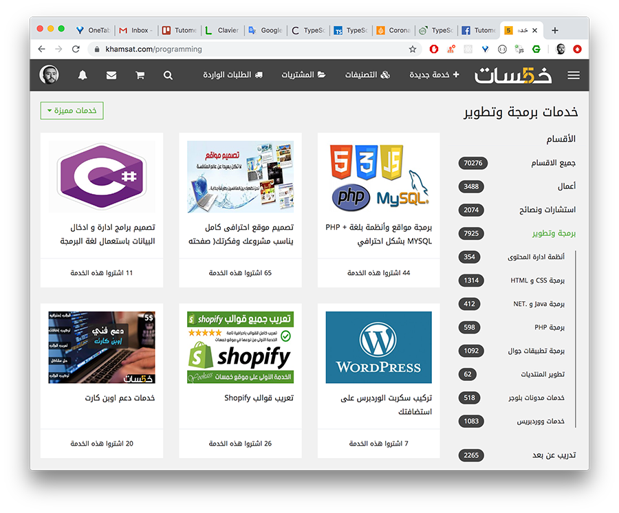
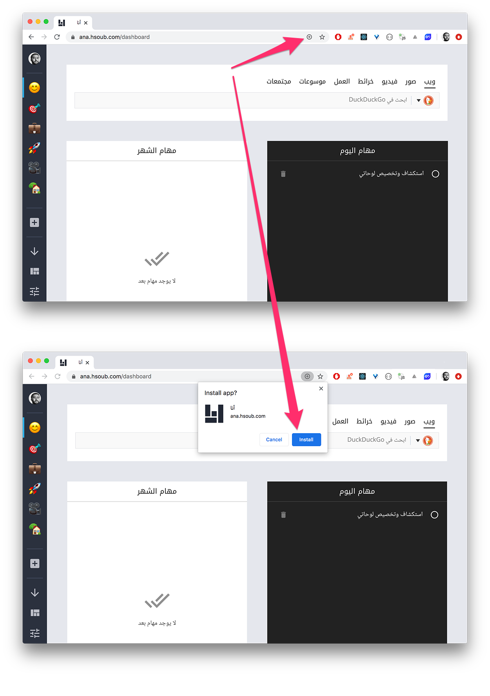
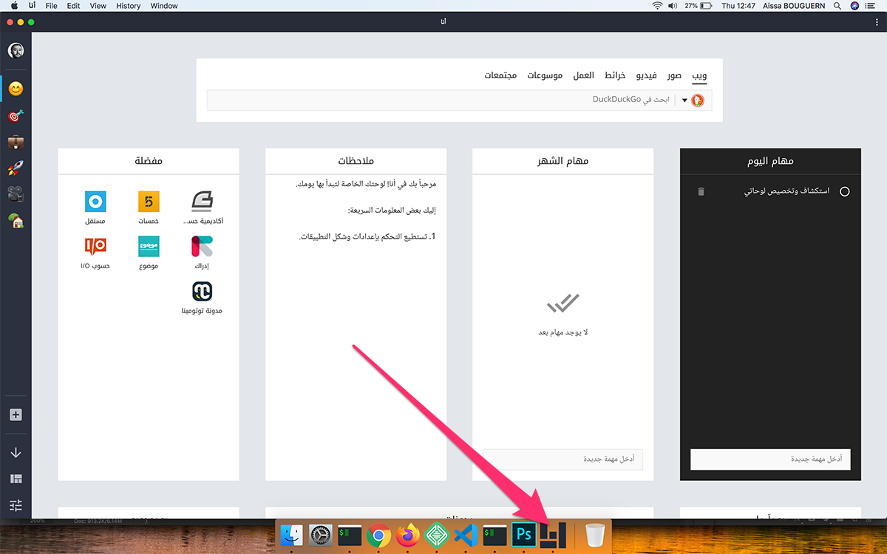

كان التحاقي للعمل في شركة حسوب واحدا من الأمور الجميلة التي حدثت معي كمطور ويب في عام 2019.

على الرغم من أن فترة عملي معهم لم تتجاوز 7 أشهر إلا أنها كانت كافية لأتعلم أشياء كثيرة وأستفيد من الخبرات التي راكمتها هذه الشركة العربية منذ تأسيسها.

في هذه التدوينة سأشارك معكم **تجربتي مع شركة حسوب** وأهم الأشياء التي استفدتها من المدة التي قضيتها **كمطور ويب عن بعد** في فريق [مشروع "أنا"](https://ana.hsoub.com/) الذي تم إطلاقها رسميا منذ مدة قصيرة.

## الفترة التجريبية

بعد [قبولي للإلتحاق بشركة حسوب](/blog/how-blogging-help-me-to-get-job)، كان لا بد لي من قضاء فترة تجريبية لمدة شهر مدفوعة الأجر. هذا هو الإجراء المتبع في هذه الشركة مع جميع المطورين الذي قاموا باستقدامهم.

منذ اليوم الأول للفترة التجريبية بدأت في التواصل بشكل مباشر مع عبد المهيمن الآغا. الأخير أسند إلي مهمة إعادة بناء واجهة المستخدم لصفحة البحث الخاصة بموقع خمسات من الصفر باستخدام **مكتبة React**.

انتهيت من المشروع **بعد 4 أيام تقريبا** على ما أذكر، وبعد أن ارتاح عبد المهيمن للعمل الذي قمت به أسند إلي مباشرة بعض المهام التي تخص **مشروع "أنا"** الذي استقدمت بالأساس لأجله. حيث أنه لم يكن يعمل في المشروع سوى مطور واجهات أمامية واحد فقط هو من بدأ المشروع، وبالمناسبة هو صديق لي سبق لي العمل معه في نفس الشركة على أرض الواقع في بداياتنا في سنة 2011 😃

بهذه الطريقة انتهى الشهر الأول (التجريبي) الذي بدأت منذ أسبوعه الثاني في العمل على المشروع الرئيسي الذي كانت الجهود تبذل ليتم الإنتهاء منه وإطلاقه في أقرب وقت ممكن.

في نهاية ذلك الشهر أرسل لي مدير الموارد البشرية في الشركة عقد العمل لكي أوقعه وأعيد إرساله لهم لأبدأ بذلك بصفة رسمية عملي كمطور ويب لحساب حسوب 😅

## مشروع "أنا"

تطبيق "أنا" أحدث مشاريع شركة حسوب، وهو في الحقيقة مشروع نوعي في الويب العربي، شأنه في ذلك شأن العديد من المشاريع التي أطلقتها الشركة في السابق.

هذا المشروع، كما [أوضح مؤسس شركة حسوب في تدوينة له](https://aalagha.com/blog/2019/12/07/ana)، ما يزال في مراحل حياته الأولى وهامش تطويره كبير جدا والعديد من الأفكار سيسعى فريق العمل لإضافتها تدريجيا في الشهور والسنوات القادمة.

من الناحية التقنية يمكن اعتبار "أنا" مشروع ويب غير مسبوق في الوطن العربي، فهو على حد علمي أول **تطبيق ويب تقدمي** عربيا. ولقد استخدمت فيه أحدث التقنيات والممارسات في ميدان تطوير تطبيقات الويب على مستوى العالم.

بطبيعة الحال سأشارك معكم أهم تلك التقنيات وكذلك النظام المتبع في الشركة لصناعة مثل هذا النوع من التطبيقات المعقدة.

### إطار العمل لارافيل

فيما يخص لغات البرمجة لتطوير النظم الخلفية فإن شركة حسوب لديها خبرات وتجارب سابقة مع لغتين اثنتين: روبي وPHP، كلاهما يستخدمان الآن في مختلف مشاريع الشركة على الإنترنت.

بالنسبة لتطبيق الويب **ANA** فقد وقع الإختيار على PHP وتحديدا [إطار العمل لارافيل](/web-development/php/إطار-العمل-لارافيل).

لست أدري بالضبط الدوافع الكاملة وراء هذا الإختيار ولكن ما نعرفه جميعا أن Laravel هو **إطار عمل PHP الأكثر شعبية** في الوقت الحالي على مستوى العالم، وقد سبقت إليه حسوب شركات عالمية معتبرة لبناء ودعم مشاريعها ومواقعها الإلكترونية. وعندما نتحدث عن شعبية كبيرة لتقنية أو لغة برمجة معينة فإننا نتحدث بشكل مباشر عن مجتمع داعم كبير أيضا، وهذا من العوامل الأساسية التي يجب أن تؤخذ بعين الإعتبار عند اختيار تقنية دون غيرها.

تطبيقنا **أحادي الصفحة**، يعني Single Page Application، وبالتالي فإن الواجهة الأمامية (Frontend) والخلفية (Backend) منفصلتان تماما (Decoupled).

النظام الخلفي للتطبيق بقيادة **لارافيل** يقوم فقط بإجراء الإستعلامات في قاعدة البيانات وإرجاع بيانات المستخدم على شكل **JSON**.

لا وجود ل HTML في كود ناحية الخادم.

عملية عرض وتحويل Json Data إلى كود Html تتولاها **مكتبة React** في الواجهة الأمامية.

### مكتبة React

بعد الحصول على البيانات من الواجهة البرمجية (API) للخادم ـ المدعومة من لارافيل ـ تقوم **مكتبة رياكت** بتحويلها وعرضها على شكل عناصر HTML. هذا تحديدا العمل الذي تبرع فيه هذه المكتبة وصممت لأجله، فهي كما نعرف **مكتبة جافا سكريبت لبناء واجهات المستخدم في تطبيقات الويب**.

في تطبيق ويب مثل **Ana** حيث التفاعلية (Interactivity) وتغير حالة التطبيق (State Changing Over Time) تتم بشكل مكثف طيلة مدة الجلسة فإن تحسين واجهة المستخدم (UI) وجعلها مستجيبة دائما يصبح أمرا ضروريا للغاية بل ومصيريا في مسألة تجربة الإستخدام.

أظن بأن هذا هو السبب الرئيسي الذي جعل المدير التقني لمشروع أنا يختار [React.js](http://localhost:8000/tags/react-js/) على حساب **Vue.js** أو **أنجولار** على سبيل المثال رغم أن Vue.js متناغم بشكل كبير مع النظام البيئي لإطار العمل لارافيل.

#### إدارة الحالة (State Management)

من المعروف أن تطبيقات React.js التي تصل إلى درجة معينة من التعقيد تعتمد عادة على مكتبة **لإدارة الحالة** مثل Redux أو MobX، ولكن في تطبيق "أنا" لم يتم استخدام أي منهما. والسبب الأول ربما هو جعل ملف ال Bundle خفيف الحجم قدر الإمكان عن طريق تجنب استخدام أي حزمة طرف ثالث إلا إذا كانت **ضرورية جدا**.

إدارة الحالة في هذا المشروع تتم فقط باستعمال React وحدها بالإعتماد على ميزة React Hooks وتحديدا `useReducer()`. هذا الأخير يوفر لنا إمكانية تغيير State بالإعتماد على **نمط Reducer** الذي تنهجه [مكتبة Redux](/web-development/javascript/redux-library/) أيضا.

ولكن كما هو معلوم Redux، تقوم بالعديد من المهام نيابة عن المطور فيما يخص تحسين (Optimizing) عملية تحديث الحالة ومزامنتها (Syncing) مع واجهة المستخدم. وعند استخدام `useReducer()` فقط في State Management فإن المطور يكون مطالبا ببذل مجهودات أكبر لتعويض عمل Redux في تحسين وتجويد مسألة إدارة الحالة وعملية المزامنة مع المكونات التي تحتاج تلك الحالة حتى يبقى التطبيق في درجة جيدة من الأداء والفعالية.

## تطبيق ويب تقدمي

من أبرز وأهم الصيحات التي بتنا نسمع عنها كثيرا مؤخرا في ميدان صناعة الويب ما يعرف **بتطبيقات الويب التقدمية** أو Progressive Web Applications واختصارا PWA.

هذه التطبيقات [وكما شرحنا في مقال سابق](/web-development/what-is-progressive-web-applications) تسعى لمنح مستخدميها تجربة مشابهة لتلك التي تمنحها التطبيقات الأصلية. وتطبيق الويب "أنا" أول تطبيق عربي معروف يوفر هذه الميزة لمستخدميه.

Ana يمكن **تثبيته على سطح المكتب** في جهاز الحاسب وكذلك في الهاتف المحمول ليظهر كباقي التطبيقات المحمولة المنزلة من مختلف المتاجر مثل جوجل بلاي ستور أو آب ستور. عند الدخول إلى التطبيق على المتصفح سيمكنك تثبيته في جهازك من خلال علامة **+** التي تظهر يمين شريط العنوان على متصفح كروم.

بعد هذا سيمكنك الدخول إلى التطبيق مباشرة دون المرور عبر المتصفح، تماما كما نفعل مع باقي التطبيقات والبرامج.

الميزة الرائعة التي توفرها كذلك تطبيقات الويب التقدمية (ولو بنسب متفاوتة) هي أنك **تستطيع الولوج إليها حتى عند عدم وجود اتصال بالإنترنت**، وتطبيق "أنا" يدعم هذه الميزة بشكل **ممتاز للغاية** حيث يمكننا فتح التطبيق والعمل عليه بشكل عادي جدا. جميع التغييرات يتم تخزينها في قاعدة بيانات **indexedDB** بالمتصفح، وعند وجود اتصال انترنت يتم **مزامنة** تلك البيانات مع الخادم بشكل ذكي لكي لا يتم فقدان العمل الذي قمنا به في وضع عدم الإتصال (Offline mode).

## برنامج Docker

لمن لا يعرف **Docker** فهو برنامج أو أداة موجهة لمدراء الأنظمة تستخدم في عمليات بناء ( Build ) وتشغيل البرامج ضمن بيئة معينة عبر تشغيل المشروع بداخل ما يصطلح عليه في بيئة دوكر **بالحاويات** أو Containers، مما يسهل عملية نقل المشروع من جهاز إلى جهاز آخر أو بيئة إلى أخرى دون الحاجة لتعديل إعدادات ومتغيرات النظام، أو تنصيب أو تحميل حزم معينة، حيث يتم فقط تنصيب [Docker](https://www.docker.com/) وتشغيل الحاويات المُعدة مسبقا بإعدادات معينة تسمح بتشغيل التطبيق ضمن هذه الحاويات.

يعتمد فريق عمل "أنا" على دوكر لتوحيد بيئات العمل بين مختلف المتدخلين في المشروع، وهم بالمناسبة 5 أشخاص. اثنان من المغرب، واحد من مصر وآخر من سوريا (مدير أنظمة) وبطبيعة الحال مدير المشروع من بريطانيا.

يساعدنا كذلك Docker على توحيد ظروف مختلف بيئات العمل التي يمر منها التطبيق، وهي ثلاث بيئات: بيئة التطوير (Development)، بيئة ما قبل الإنتاج (Staging) وأخيرا بيئة الإنتاج (Production).

هذا وتوفر **منصة دوكر** مزايا كثيرة أخرى خاصة فيما يتعلق بأتمتة عمليات النشر (Deployment Automation) والتركيب المتواصل (Continuous Integration) أو ما يصطلح عليه اختصارا ب **CI/CD**.

عملية إعداد [Docker](https://3alam.pro/3mmarg97/series/introduction-to-docker/lessons/what-is-docker) والإشراف عليه يتولاها **مدير الأنظمة** أو DevOps Manager.

**الجديد بالذكر أن Docker كان له الفضل كذلك في أنني اشتريت جهاز Macbook Pro نسخة 2017 😄 لأن جهاز ماكبوك برو القديم الذي كنت أستخدمه منذ عام 2015 كان موديل 2010 وهو غير مدعوم بشكل جيد من دوكر وواجهت معه مشاكل عديدة فيما يخص تشغيل هذا البرنامج.**

## الإجتماعات الدورية

العمل عن بعد في مشروع يشارك فيه عدة مطورين يحتم ويجعل من الواجب القيام باجتماعات واتصالات دورية شبه يومية للوقوف على تقدم العمل. بعض الإجتماعات تكون بين المطور ومدير المشروع والبعض الآخر بين المطورين أنفسهم للإتفاق على مختلف النقاط والتفاصيل التي يعملون عليها.

بالنسبة لي فقد كنت أجتمع بعبد المهيمن تقريبا مرتين في الأسبوع أو ثلاثة على الأكثر. والإتصال يتم عادة إما عبر سكايب أو عبر منصة تستخدم داخليا في شركة حسوب بحيث يتواجد فيها جميع العاملين في الشركة.

## البيئة الجيدة وثقافة التعارف

بعد المدة التي قضيتها في شركة حسوب، يمكنني القول بأن واحدا من أهم مميزاتها هو روح التعارف بين موظفيها. بمجرد الإلتحاق بالشركة تتلقى العديد من رسائل الترحيب والإستقبال من الموظفين القدامى 💛 بل واتصل بي العديد منهم صوتيا لكي يتعرفوا علي بشكل أفضل، ولقد كان الجميع ودودين للغاية ما يجعل الإندماج سهلا على القادمين الجدد.

لتحسين هذه البيئة بشكل مستمر تقوم الشركة **كل 6 أشهر** بإجراء استبيان (Survey) يشارك فيه **جميع موظفي حسوب**، يجيبون فيه عن مجموعة من الأسئلة التي تتعلق أساسا ببيئة العمل ومدى شعورهم بالرضى والسعادة.

بعد مدة من الإستبيان يتولى مدير الموارد البشرية الإتصال بكل الموظفين ليناقش معهم إجاباتهم حول ذلك الإستبيان.

## أخيرا

في أكتوبر من العام الماضي تقدمت بطلب الإستقالة لظروف شخصية في ذلك الوقت، والأكيد أن تجربتي هذه كانت ثرية واستفدت منها الكثير وسيكون من دواعي سروري أن تتاح لي فرصة العمل مع شركة مثل حسوب مرة أخرى.

مشروع "أنا" لقي رضى عدد كبير من المستخدمين العرب فور إطلاقه، وأظن بأنه يستحق النجاح والفريق العامل في كواليسه يستحقون الشكر والتنويه لأنهم ظلوا **طيلة عام ونصف تقريبا** يعملون ويسابقون الزمن للخروج بمنتج حُق للمستخدم العربي أن يفخر به.

> رهن إشارتكم إذا كانت لديكم أسئلة أو مزيد من الإستفسارات حول هذه التجربة.

<Author slug="aissa" />
