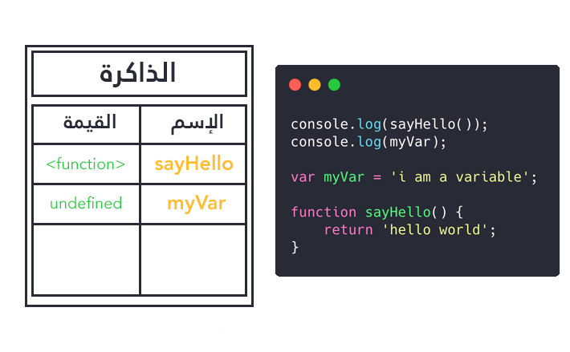
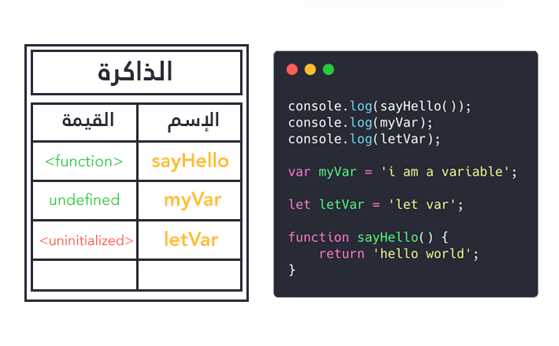

هل سبق لك أن تساءلت عن سبب قدرتنا على استدعاء دالة جافا سكريبت في مكان أعلى من الموضع الذي تم فيه التصريح بها ؟ وهل لاحظت عدم إمكانية فعل ذلك مع الأنواع الأخرى من المتغيرات ؟

الأكيد أنك عند البحث عن سبب كل ذلك واجهتك كلمة **Hoisting** وقرأتها في أماكن عديدة.

ما هو Hoisting إذن ؟ وما علاقته بهذا النوع من سلوكيات لغة البرمجة جافا سكريبت ؟

هذا ما سنعرفه ونتعلمه معا في هذا الدرس.

## ماذا يجري في الكواليس ؟

لنبدأ بهذا الكود:

```js
console.log(sayHello()); // Hello world
console.log(myVar); // undefined

var myVar = 'i am a variable';

function sayHello() {
  return 'hello world';
}
```

عند تنفيذ ما سبق سنلاحظ بأن الدالة `sayHello()` تم تنفيذها بدون مشاكل حتى قبل أن يتم التصريح بها في الكود! بينما لم نستطيع الحصول على قيمة المتغير `myVar` قبل إنشائه، وبدلا عن ذلك حصلنا على القيمة `undefined`.

**فماذا سبب ذلك يا ترى ؟**

## إعداد الذاكرة

**قبل تنفيذ أي كود** يقوم محرك الجافا سكريبت في المتصفح **بإعداد الذاكرة أولا**، وهنا تحدث الإختلافات التي تؤدي لمثل تلك الآثار الجانبية التي رأيناها أعلاه.

طريقة التعامل مع الدوال في الذاكرة خاصة ومختلفة عن طريقة التعامل مع المتغيرات، فهي تخزن على شكل مرجع (reference) يؤشر على **كامل محتوى الدالة**. وبالتالي بمجرد أن تدخل تلك الدالة في حسبان الذاكرة فإنه يمكننا استدعاؤها في أي مكان في الكود **داخل النطاق الذي تم فيه التصريح بها** (Execution context) وفي الحالة أعلاه هو **window** بالنسبة للمتصفح و **global** بالنسبة لبيئة Node.js.

> الكلام الذي قلناه الآن **صحيح فقط** بالنسبة للدوال المصرح بها بطريقة function declaration وليس الدوال التي تم إنشاؤها بطريقة function expression. هذه الأخيرة تتبع نفس سلوك المتغيرات الذي سنشرحه الآن.

فيما يخص المتغيرات فالذاكرة تسلك **منهجا مختلفا** تجاهها. فبالنسبة للمتغيرات التي انشاؤها بواسطة `var` فإنها يتم تخزينها في الذاكرة في البداية بإعطائها القيمة `undefined` ولذلك حصلنا على القيمة في المثال السابق عندما حاولنا عرض المتغير `myVar` قبل إنشائه.

## كلمة Hoisting

ترجمة كلمة Hoisting للإنجليزية تعني **الرفع**، وفي جافا سكريبت يمكننا تعريفها الآن بأنها **الآلية التي يتبعها محرك جافا سكريبت لرفع المتغيرات والدوال إلى أعلى نطاق التنفيذ الخاص بها (Execution context) في الذاكرة**.

الدالة يتم رفعها (**Hoisted**) لأعلى **نطاق التنفيذ** على شكل مرجع يؤشر على كامل الدالة وبالتالي يمكن استدعاؤها وتنفيذها **سواء أعلى مكان التصريح بها أو تحته**، بينما المتغيرات المنشأه بواسطة `var` يتم رفعها وإعطائها القيمة `undefined` افتراضيا.



## const و let لها خصوصياتها كذلك

من المزايا الجديدة التي جاءت مع إصدار جافا سكريبت ES6 نجد إمكانية إنشاء المتغيرات باستخدام الكلمتين المفتاحيتين `const` و `let` وليس فقط `var` كما كان عليه الحال دائما في إصدارات جافا سكريبت القديمة.

`const` و `let` لهما سلوك مختلف عن `var` في موضوع Hoisting.

متغيرات `var` كما قلنا يتم إعطاؤها `undefined` كقيمة افتراضية في الذاكرة، بينما متغيرات `const` و `let` يتم التأشير عليها على أنها **غير مهيأة** أو uninitialized، وإذا حاولنا الوصول إليها أعلى مكان التصريح بها فإن جافا سكريبت **سيظهر رسالة خطأ** `ReferenceError` يتوقف بموجبها البرنامج عن التنفيذ.

```js
console.log(sayHello()); // "hello world"
console.log(myVar); // undefined
console.log(letVar); // ReferenceError: Cannot access 'letVar' before initialization

var myVar = 'i am a variable';

let letVar = 'let var';

function sayHello() {
  return 'hello world';
}
```

المنطقة قبل مكان التصريح بمتغيرات `const` و `let` في نطاق التنفيذ الخاص بها تسمى **Temporel dead zone**، حيث لا يمكنك استعمال أي من تلك المتغيرات.

نفس هذا الكلام **صحيح بالنسبة للكلاسات** (Classes) المدعومة كذلك منذ إصدار جافا سكريبت ES6.



> موضوع مهم ذات صلة: [الفرق بين let ،var و const في جافاسكريبت](/web-development/javascript/var-let-const-javascript-es6/)

## اختبار 😃

لكي نتأكد من أننا ا ستوعبنا بشكل جيد مفهوم ال Hoisting في جافا سكريبت يجب أن نتوقع بشكل جيد نتيجة الكود التاليs:

```js
var x = 100;

function hoist() {
  if (false) {
    var x = 200;
  }
  console.log(x);
}

hoist();
```

هيا فكر قليلا يا صديقي، لا تنزل للأسفل إلا بعد أن تقف على جواب محدد ...

<p style="text-align: center;">
🤔
</p>

<p style="text-align: center;">
🤔
</p>

<p style="text-align: center;">
🤔
</p>

<p style="text-align: center;">
🤔
</p>

<p style="text-align: center;">
🤔
</p>

إذا كان جوابك هو `undefined` فأهنئك 👍 لقد استوعبت الموضوع بشكل جيد.

وإذا كان الجواب غير ذلك فتعال بنا نشرح سبب تلك النتيجة.

في هذا المثال، قمنا بإنشاء متغير `x` في النطاق العام (Global Scope) وأعطيناه القيمة `100`، وفي داخل الدالة `hoist()` أنشأنا متغير بنفس الإسم داخل الجملة الشرطية `if`.

الشرط هنا لن يتحقق أبدا كما هو واضح من مضمونه `if(false)`.

إذن قد نتوقع أن يتم عرض القيمة `100` من طرف `console.log` ولكن هذا ليس واقع الحال. لماذا ؟

السبب هو أن المتغير `x` في داخل الجملة الشرطية قد تم رفعه (Hoisted) إلى **أعلى أقرب نطاق ينتمي إليه**. هذا النطاق هنا هو الدالة `hoist()` لأن متغيرات `var` كما نعلم هي **Function Scoped**، وبالتالي فحتى لو لن يتم تنفيذ ذلك الكود أبدا إلا أن محرك جافا سكريبت (JavaScript Engine) قد أخذه بعين الإعتبار في مسألة ال Hoisting وذلك في فترة إعداد وتهيئة الذاكرة كما أشرنا سابقا.

الكود السابق ستتم قراءته من طرف مترجم جافا سكريبت بهذه الطريقة:

```js
var x;
x = 100;

function hoist() {
  var x; // Hoisting --> x = undefined
  if (false) {
    x = 200;
  }
  console.log(x); // undefined
}

hoist();
```

إذن يجب الحذر جيدا عند كتابة مثل هذه الأكواد. في بعض الأحيان يتصرف الجافا سكريبت على نحو **غير متوقع** إذا لم نفهم بشكل جيد الآليات التي يعتمد عليها.

إذا قمنا بتعويض `var` ب `let` أو `const` في الكود السابق ستتم عملية Hoisting **بشكل مختلف** ونحصل على نتيجة مختلفة لأن `let` و `const` تعتبران Block Scoped فينحصر نطاقهما في ما بين معقوفتي التعبير الشرطي `if`.

```js
let x = 100;

function hoist() {
  if (false) {
    let x = 200;
  }
  console.log(x); // 100
}

hoist();
```

## في الختام

إلى هنا نكون قد قلنا أهم ما يجب أن يقال حول عملية ومفهوم الرفع أو **Hoisting** في لغة البرمجة جافا سكريبت.

باختصار:

- قبل التنفيذ الفعلي للكود، يتم أولا إعداد الذاكرة ويتم رفع جميع المتغيرات والدوال إلى أعلى النطاقات (Scopes) التي تتبع لها. هذه العملية تسمى **Hoisting**.
- الدوال يتم رفعها مع مرجع كامل إلى الدالة ذاتها.
- متغيرات `var` يتم رفعها مع `undefined` كقيمة افتراضية.
- متغيرات `const` و `let` يتم رفعها واعتبارها غير مهيأة أو `uninitialized`، مما يتسبب في **إطلاق خطأ من طرف محرك جافا سكريبت إذا حاولنا الوصول إليها قبل التصريح بها**.

---

#### مراجع مهمة

- [JavaScript Visualized: Hoisting](https://dev.to/lydiahallie/javascript-visualized-hoisting-478h)
- [Understanding Variables, Scope, and Hoisting in JavaScript](https://www.digitalocean.com/community/tutorials/understanding-variables-scope-hoisting-in-javascript#hoisting)

<Author slug="aissa" />
