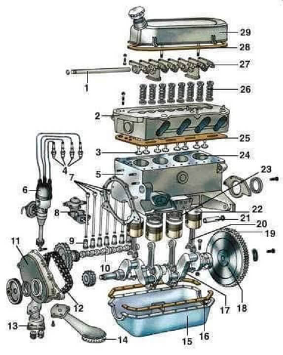
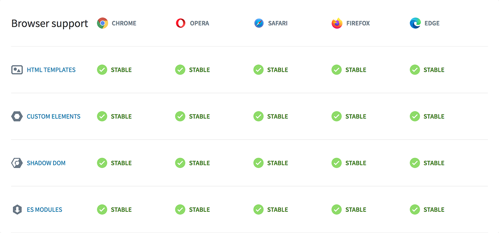
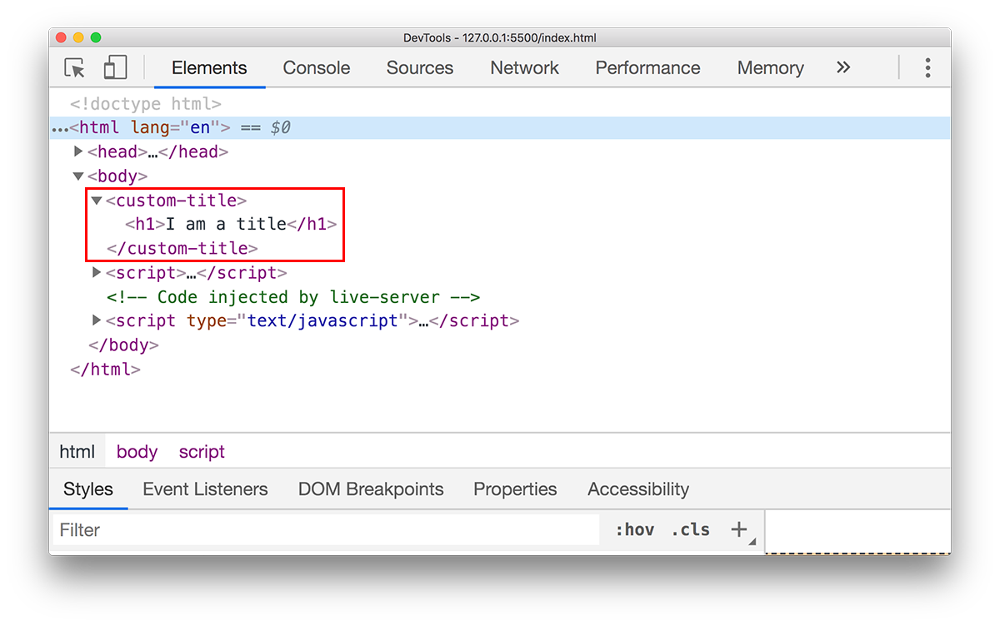
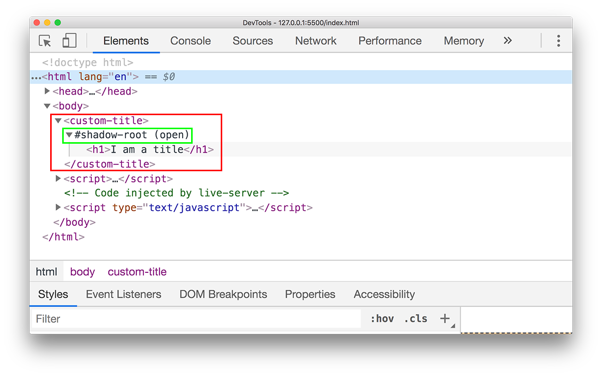

كلمة **المكونات** أو **Components** أصبحنا نسمع بها بشكل كبير في كل مكان بمجال تطوير الويب. هذا المفهوم بات جزءًا أساسيا في صندوق أدوات بناء تطبيقات الويب الحديثة.

نقصد بمكونات الويب أجزاء من واجهة المستخدم مستقلة بذاتها ومسؤولة عن مهام محددة وقابلة لإعادة الإستخدام في أكثر من مكان.

هذه المكونات تشكل في النهاية معا النظام الكامل، وعند حدوث عطل أو خطأ في جزء معين من أجزاء هذا النظام يكفي أن نقوم بإجراء الإصلاحات على المكون المسؤول عن ذلك الجزء بمعزل عن باقي المكونات.

فكرة المكونات لم يسبق إليها مطورو الويب، بل لها وجود قديم في كثير من المجالات مثل الصناعات الميكانيكية على سبيل الذكر لا الحصر.

ويمكننا أن نستدعي هنا مثال محرك السيارة الذي يتركب من عشرات المكونات والقطع الصغيرة، وكل قطعة مسؤولة عن فعل معين لا تتجاوزه. ويمكنها التفاعل والعمل مع باقي الأجزاء بشكل متناغم وسلس لضمان عمل النظام (المحرك) من دون مشاكل.



بنفس الطريقة يمكن تقسيم واجهات المستخدم في تطبيقات الويب إلى عدة مكونات، وكل مكون يمكن أن تتفرع عنه مكونات أصغر وأبسط.


كما نرى في هذه الصورة، هناك عدة مكونات في واجهة موقع تويتر:

- مكون لحقل البحث.
- مكون للقائمة الرئيسية (Navigation).
- مكون التغريدة.
- مكون المستخدمين المقترحين.
- ...

كل واحد من هذه المكونات **مستقل بذاته**، ويمكن **نقله وإعادة استخدامه** في أي مكان بشرط إمداده وإعداده بالبيانات التي يحتاج إليها.

## كيف بدأ الحديث عن مكونات الويب

بدأ القائمون على المتصفحات الكبيرة مثل كروم وفايرفوكس، ومن خلفهم منظمة W3C، منذ وقت طويل نسبيا في التفكير ببناء ودعم واجهة برمجية تسمح لمطوري الويب ببناء مكونات ويب بدون الحاجة إلى أي مكتبات أو حلول طرف ثالث. وقد كان أحد مهندسي جوجل يدعى [أليكس راسل](https://infrequently.org/about-me/) أول من قام بتقديم هذه الميزة والتحدث عنها في مؤتمر Fronteers Conference عام 2011 بمدينة أمستردام.

بعد هذا المؤتمر بأربعة أعوام قام مطورو جوجل بإصدار **مكتبة Polymer** التي تساعد المطورين على بناء مكونات ويب بطريقة موحدة مع توفير Polyfills لضمان توافقية جيدة مع مختلف المتصفحات الكبيرة.

مشروع Polymer ما يزال قائما وحيا إلى يومنا هذا (وصل إلى الإصدار 3) ومازال مستخدما في أكبر مشاريع جوجل وعلى رأسها **موقع يوتيوب**. في الرغم من تقدم العمل بشكل كبير على **Web Components API** ووصولها لمرحلة متقدمة جدا من الإستقرار والدعم الكافي من مختلف المتصفحات الكبيرة.



### دور React.js

لم يكن مطورو الويب على استعداد للإنتظار كل هذا الوقت الطويل حتى تصل واجهة Web Components API إلى الإستقرار المثالي للإعتماد عليها في مشاريع حقيقية. لذلك سارع عدد منهم إلى بناء مكتبات طرف ثالث حاولت استنساخ مفهوم مكونات الويب على على طريقتها الخاصة، وكان أول من تجسدت جهودهم في هذا الشأن مطورو **فيسبوك** الذي قاموا ببناء مكتبة لدعم وبناء واجهات المستخدم في منصة فيسبوك بالإعتماد على فكرة مكونات الويب. هذه المكتبة ـ بعد الإستعانة بها لسنوات داخليا ـ تم جعلها مكتبة ومشروعا مفتوح المصدر في أواسط عام 2013 تحت مسمى **رياكت** أو [React](/web-development/javascript/react-javascript-library/).

[React](/web-development/javascript/react-javascript-library/) حققت ما لم يستطع تحقيقه مشروع Polymer بلفتها انتباه المطورين حول العالم إلى نمط وفكرة ال Components، فحققت بذلك ثورة حقيقية في طريقة بناء User Interfaces الخاصة بمشاريع الويب.

بعد React هرعت مكتبات وأطر عمل أخرى لتحديث نفسها والإنتقال لإعتناق فكرة المكونات وعلى رأسها [Angular](/tags/angular/) و [Vue.js](/tags/vuejs/).

القاسم المشترك بين كل هذه المكتبات (باستثناء Polymer) أنها لا تعتمد بأي شكل على واجهة Web Components API، بل وجد كل منها طريقته الخاصة لتنفيذ وتجسيد تلك الفكرة. رياكت عبر ميزة JSX، وAngular و Vue عبر نظام قوالب أو Templates.

## Web Components API

إذن فهمنا من خلال ما سبق أن كل مكون ويب عبارة عن وحدة في واجهة المستخدم مسؤولة عن مهمة أو مهام محددة، وكل مكون يقوم بتغليف (Encapsulate) حالته الخاصة وأكواد HTML (القالب) و Css الخاصة به. هذا ما تحاول مكونات الويب الأصلية فعله من خلال واجهة Web Components وذلك بالإعتماد على **3 أدوات أو ركائز أساسية** وهي:

- Custom Elements.
- Shadow DOM.
- Templates.

سنشرح كل واحد منها حتى يفهم الجميع طريقة عمل **مكونات الويب** وكيفية تناغم هذه الأجزاء الثلاثة مع بعضها البعض.

### 1. Custom Elements

كما يدل عليه الإسم، فإن ميزة Custom Elements تمكننا من إنشاء عناصر HTML **مخصصة** إلى جانب العناصر الأصلية والأساسية التي نعرفها جميعا مثل `div`، `p` و `span`. ويشترط في أسماء العناصر المخصصة أن تتضمن العارضة الأفقية `-` لتمييزها عن العناصر الأصلية في HTML التي تخلو أسماؤها من أية رموز غير الحروف.

فعلى سبيل المثال **لا يسمح** باستعمال الإسم التالي لأي عنصر مخصص في HTML:

```html
<title>I'm a title</title>
```

بينما يسمح باستخدام اسم من هذا القبيل:

```html
<custom-title>I'm a title</custom-title>
```

لإنشاء عنصر مخصص يجب علينا الاستعانة بكلاس **يرث** بعض الخصائص والوظائف من الكلاس الأصلي `HTMLElement`.

إليكم الطريقة:

```js
class CustomTitle extends HTMLElement {
  connectedCallback() {
    this.innerHTML = `<h1>I am a title</h1>`;
  }
}

customElements.define('custom-title', CustomTitle);
```

نلاحظ أننا قمنا بتعيين محتوى المكون `CustomTitle` داخل الوظيفة `connectedCallback()` والتي تعتبر من **وظائف دورة حياة** مكونات الويب الأصلية، على شاكلة Lifecycle Methods الموجودة في مكتبات وأطر عمل مثل React أو Vue.

هذه الوظيفة يتم تنفيذها في الوقت الذي **يتم فيه تركيب المكون في شجرة DOM**، وهي مرادف لوظيفة `mounted` في [Vue](/web-development/javascript/3-reasons-to-choose-vuejs-framework/) أو `ComponentDidMount` في React.

في هذه الوظيفة يمكننا كذلك القيام بطلبات أجاكس لجلب البيانات التي ربما سيحتاجها المكون (Data Fetching).

في السطر الأخير قمنا بإعطاء اسم **للوسم** الذي سيعبر عن المكون `CustomTitle` وربطهما معا عن طريق الوظيفة `customElements.define()`.

في هذا المثال اخترنا الإسم `custom-title`.

هناك وظائف أخرى لدورة حياة مكونات الويب مثل:

- `disconnectedCallback()`: كما يتضح من اسمها تنفذ **عندما يتم إزالة المكون من شجرة DOM**. وتستخدم لتنظيف (Clean up) الذاكرة من بعض الأمور التي تخص المكون المحذوف مثل الأحداث وغيرها...
- `attributeChangedCallback()`: هذه الوظيفة يتم استدعاؤها **في كل مرة يتم فيها إجراء تغيير على مستوى إحدى صفات (Attributes) العنصر**. هذا التغيير قد يكون إضافة صفة جديدة، حذفها أو تغيير قيمتها. الصفات التي سيتم تتبعها هي المذكورة في المصفوفة التي يتم إرجاعها من طرف الوظيفة الساكنة `observedAttributes()` داخل كلاس العنصر.

<div class="filename">Example</div>

```js
class CustomElement extends HTMLElement {
  static get observedAttributes() {
    return ['attribute'];
  }

  attributeChangedCallback(attrName, oldValue, newValue) {
    // ...
  }
}
```

وبذكر صفات المكون (Attributes) فإنه يمكن الوصول إليها عن طريق الوظيفة `getAttribute(attrName)` من داخل كلاس المكون بهذه الطريقة:

```js
this.getAttribute('example');
```

الصفات أو الخصائص من المزايا الأساسية لكل مكون ويب فعن طريقها يمكن للمستخدم أن يتحكم به ويعيد استخدامها في أماكن مختلفة.

### 2. Shadow DOM

عندما نريد تغطية (Encapsulate) أكواد جافا سكريبت وكذلك CSS الخاصة بالعنصر أو المكون فإننا نقوم بربطه بما يسمى Shadow DOM. هذا الأخير يمكن اعتباره بمثابة `iframe` (تقريبا) **لا يمكن الوصول إليه والدخول إليه إلا من خلال المكون نفسه**.

في المثال الأول، حيث العنصر `custom-title`، نلاحظ أننا قمنا فقط بإضافة العنصر `h1` إلى `custom-title` بشكل مباشر دون المرور عبر أي `ShadowDOM`، وبالتالي فمحتوى العنصر **غير مغطى وغير محمي** ويمكن الوصول إليه من أي مكان في الصفحة، سواء من طرف جافا سكريبت أو CSS.



لو قمنا بعمل `document.querySelector('h1')` من أي مكان في كود جافا سكريبت فسيمكننا الحصول نسخة من عقدة `h1`، وكذلك سيتأثر العنوان بأي تنسيق CSS نقوم بإضافته للصفحة مادام يستهدف الوسم `h1`.

إذن الحل هو أن نقوم بربط العنصر المخصص بشجرة DOM خاصة به تسمى كما قلنا ب **Shadow DOM**، ويكون Custom Element هو الوحيد القادر على على التعامل معها. هكذا سنحقق إحدى غايات مكونات الويب المهمة وهي أن يكون لكل مكون حالته الخاصة وكذا تنسيقه الخاص الذي لا يتأثر به سوى عناصر HTML الموجودة داخل نطاق وتحت نفوذ المكون.

الطريقة بسيطة للغاية وهي كالتالي:

```js{2-5,7}
class CustomTitle extends HTMLElement {
  constructor() {
    super();
    this.attachShadow({ mode: 'open' });
  }
  connectedCallback() {
    this.shadowRoot.innerHTML = `<h1>I am a title</h1>`;
  }
}

customElements.define('custom-title', CustomTitle);
```

ربطنا العنصر `CustomTitle` ب Shadow DOM عن طريق الوظيفة `attachShadow` التي يرثها من الكلاس الأصلي `HTMLElement`. بعد ذلك يمكننا التعامل مع كافة العقد والعناصر التي تدخل في نطاقه بالإعتماد على الخاصية `this.shadowRoot` التي استخدمناها في مثالنا لإضافة العنوان `h1` إلى العنصر المخصص `custom-title`.



الآن إذا قمنا بتنفيذ `document.querySelector('h1')` في هذه الصفحة فسنحصل على القيمة `null` لأن الكائن `document` ليس له الحق في الوصول إلى `h1` الموجود داخل Shadow DOM التابع للعنصر `custom-title`.

> لهذا قلت في البداية إن سلوك Shadow DOM يشبه إلى حد ما سلوك وسم `iframe` الذي لا يمكننا الوصول إلى محتواه بواسطة جافا سكريبت إلا من داخل `iframe` نفسه (مبدأ التغطية أو Encapsulation).

لكي نتمكن من الوصول إلى `h1` (من داخل `CustomTitle`) بواسطة DOM API يجب علينا أولا المرور عبر Shadow DOM وذلك باستعمال الخاصية `this.shadowRoot`:

```js
this.shadowRoot.querySelector('h1');
```

الآن سنعتمد على ميزة ومبدأ Encapsulation الذي يوفر لنا Shadow DOM لكي نقوم بإضافة تنسيق CSS خاص بمكوننا.

سنستعين في هذا على الضلع الثالث من سلسلة الأضلاع الثلاثة التي تشكل قوة مكونات الويب: ميزة **Templates**.

### 3. Templates

من بين الوسوم الجديدة التي توفرت لنا مع إصدار **HTML 5** وسم `<template>`. هذا الوسم معظمنا لم يستخدمه ولم يسمع عنه من قبل، ولكن مع تقدم العمل على تقنية Web Components وتطورها أصبح جزءًا أساسيا من التوليفة وبات حضوره أكثر قوة.

يمكننا الوسم `<template>` من إضافة **قوالب HTML** لصفحة الويب دون عرض محتوى تلك القوالب. ذلك المحتوى لن يتم عرضه حتى يقرر جافا سكريبت ذلك.

إذن عندما نضيف القالب التالي إلى صفحتنا فلن يتغير أي شيء، حيث أن قارئ ومحلل HTML في متصفحنا سيتجاهله مادامت الأوامر لم تأتي من **جافا سكريبت** بعرض ما فيه.

```html
<template id="template">
  <h1>I am a title</h1>
</template>
```

بالعودة إلى مثالنا، سنطلب من العنصر `CustomTitle` أن يعرض محتوى القالب `#template` عوضا عن استخدام الخاصية `innerHTML`.

```js{7,8,9}
class CustomTitle extends HTMLElement {
  constructor() {
    super();
    this.attachShadow({ mode: 'open' });
  }
  connectedCallback() {
    const template = document.getElementById('template');
    const node = document.importNode(template.content, true);
    this.shadowRoot.appendChild(node);
  }
}

customElements.define('custom-title', CustomTitle);
```

قمنا بإنشاء عقدة (Node) جديدة بالإعتماد القالب `#template` ثم أضفناها ل Shadow DOM بفضل الوظيفة `appendChild`.

الآن إذا ألقينا نظرة على الصفحة في متصفحنا سنجد نفس النتيجة ولن نلاحظ أي فرق.

#### إضافة تنسيق CSS إلى القالب

بواسطة قوالب HTML يمكننا إضافة تنسيقات وأكواد CSS **خاصة بمكوناتنا** مع ضمان ألا تتأثر بقية عناصر الصفحة بها.

الطريقة سهلة جدا:

```html
<template id="template">
  <style>
    h1 {
      color: #ff0000;
    }
  </style>
  <h1>I am a title</h1>
</template>
```

لاحظوا أننا قمنا بإضافة التنسيق باستعمال الوسم `<style>` كما نفعل دائما عند إضافة التنسيقات إلى أي صفحات ويب. الفرق هذه المرة أننا فعلنا ذلك داخل قالب HTML، وبفضل Shadow DOM لن يتأثر أي عنصر `h1` آخر خارج مكوننا باللون الأحمر `color: #ff0000`.

#### تعديل بسيط (إضافة slot)

الشيء المؤكد أن المثال الذي اخترته لهذا الدرس ـ مكون `CustomTitle` ـ ليس أفضل مثال في العالم 😅 لست ملهما بما يكفي في وقت إعداد هذا الدرس. لذلك سأجري عليه تعديلا بسيطا لعله يكون أفضل بقليل.

ما سأقوم به هو أنني سأطلب من مكوننا أن يطبع النص الذي نمرره بين الوسمين `<custom-title>` و `</custom-title>` عوض طباعة النص الجاهز `I am a title`. هذا سيكون عمليا أكثر، أليس كذلك ؟ 🤔

```html
<custom-title>Some title</custom-title>
```

يمكننا القيام بهذه المهمة ببساطة شديدة بفضل الوسم `<slot>` الذي يمكننا إضافته داخل قالب المكون على هذا الشكل:

```html{7}
<template id="template">
  <style>
    h1 {
      color: #ff0000;
    }
  </style>
  <h1><slot></slot></h1>
</template>
```

أظن أن الموضوع واضح كفاية، فمفهوم **Slots** موجود ونعرفه منذ مدة في أطر عمل جافا سكريبت وغير جافا سكريبت.

## مثال مكون العداد

مثال العداد أو Counter هو المثال الذي يتم به تقديم أغلب أطر عمل جافا سكريبت (إلى جانب Todo List بطبيعة الحال 😃). لذلك لن نخرج عن القاعدة في نهاية هذا الدرس، فأشارك معكم الكود الكامل لعداد بسيط استعملت فيه عدد من مزايا مكونات الويب التي تعلمناها في هذا الدرس.

```js
class theCounter extends HTMLElement {
  constructor() {
    super();
    this.attachShadow({ mode: 'open' });

    this.min = +this.getAttribute('min') || 0;
    this.max = +this.getAttribute('max') || null;

    this.count = this.min;

    // Binding
    this.increment = this.increment.bind(this);
    this.decrement = this.decrement.bind(this);
  }

  connectedCallback() {
    const template = document.getElementById('template');
    const node = document.importNode(template.content, true);
    this.shadowRoot.appendChild(node);
    // Buttons
    const incrementBtn = this.shadowRoot.querySelector('#increment');
    const decrementBtn = this.shadowRoot.querySelector('#decrement');

    incrementBtn.addEventListener('click', this.increment);

    decrementBtn.addEventListener('click', this.decrement);

    // Initial state
    this.refresh(this.count);
  }

  disconnectedCallback() {
    // Buttons
    const incrementBtn = this.shadowRoot.querySelector('#increment');
    const decrementBtn = this.shadowRoot.querySelector('#decrement');

    incrementBtn.removeEventListener('click', this.increment);

    decrementBtn.removeEventListener('click', this.decrement);

    // Initial state
    this.refresh(this.count);
  }

  increment() {
    this.count = !this.max
      ? this.count + 1
      : this.count < this.max
      ? this.count + 1
      : this.count;
    this.refresh(this.count);
  }

  decrement() {
    this.count = this.count > this.min ? this.count - 1 : this.count;
    this.refresh(this.count);
  }

  refresh(value) {
    this.shadowRoot.querySelector('#value').innerHTML = value;
  }
}

customElements.define('the-counter', theCounter);
```

يمكنكم ملاحظة بأن العداد يقبل خاصيتين: `min` و `max` وهما كما يتضح من اسميهما القيمة الدنيا والقيمة القصوى للعداد. عندما لا يتم تعيين الخاصية `min` فإننا نفترض بأن قيمتها تساوي `0` بينما القيمة الإفتراضية ل `max` هي `null`.

نلاحظ كذلك أننا استعننا بالوظيفتين `connectedCallback` و `disconnectedCallback` لعمل Event Listening في الأولى والتخلص منه في الثانية كما شرحنا منذ لحظات.

الوظيفتين `increment()` و `decrement()` مسؤولتين عن زيادة وإنقاص قيمة العداد `this.count` بناء على قيمة الصفتين `min` و `max`.

أما الوظيفة `refresh()` التي يتم استدعاؤها في البداية وبعد كل عملية نقر على أحد زري العداد فمهمتها هي تحديث Shadow DOM وذلك بتغير القيمة النصية للعنصر `span#value`.

كذلك قمنا بعمل **Binding** للوظيفتين `increment()` و `decrement()` في `constructor`، وذلك لضمان أن الكائن `this` يؤشر على الكلاس `theCounter` وليس على الحدث `click`. مطورو رياكت لن يجدوا صعوبة في فهم هذه المسألة لأنها موجودة بنفس الشكل في React Class Components 🙂

قالب العداد سيكون شيئا من هذا القبيل :

```html
<template id="template">
  <style>
    button {
      border: none;
      background: #000;
      color: #fff;
      padding: 10px 18px;
      font-size: 20px;
      outline: 0;
    }
    span {
      font-size: 24px;
      display: inline-block;
      margin: 0 10px;
    }
  </style>
  <button id="increment">+</button>
  <span id="value"></span>
  <button id="decrement">-</button>
</template>
```

أما العنصر `theCounter` فيتم استخدامه في صفحة الويب بهذه الطريقة:

```html
<the-counter min="5" max="50"></the-counter>
```

## بيئة مكونات الويب

بيئة مكونات الويب أو **Web Components** تصبح غنية يوما بعد يوم، وشيئا فشيئا يتم الحديث عنها في أوساط مطوري الويب.

تقريبا جميع أطر عمل جافا سكريبت المعروفة بما فيها رياكت، Vue و أنجولار تدعم مكونات الويب، إذ يمكن استيراد مكون ويب مستقل واستخدامه مع أنجولار مثلا بسهولة ومع قليل من الإاعدادات.

إضافة إلى ذلك، هناك مكتبات تمكننا من بناء مكونات ويب بفعالية أكبر وذلك بتوفير واجهات برمجية في المتناول. هذا ما تفعله مكتبة [Stencil](https://stenciljs.com/) على سبيل المثال التابعة لفريق [Ionic](https://ionicframework.com/docs). هذه المكتبة تمكننا من بناء مكونات مع دعم [لتايب سكريبت](/what-is-typescript) وصيغة JSX وكأننا في مشروع React.

### مثال لمكون ويب في Stencil

```jsx
import { Component, Prop } from '@stencil/core';

@Component({
  tag: 'my-first-component'
})
export class MyComponent {
  // Indicate that name should be a public property on the component
  @Prop() name: string;

  render() {
    return <p>Hello {this.name}</p>;
  }
}
```

المكون أعلاه يمكننا من طباعة اسمنا وبجانبه ومعه كلمة `Hello`. الإسم يتم تمريره للمكون على شكل خاصية اسمها `name` من نوع `string`.

الوسم الخاص بالمكون هو `my-first-component` وكما تلاحظون يتم تمريره عبر المُزخرِف `@Component` (مطوري أنجولار هل أنتم هنا ؟ 😎)

```html
<my-first-component name="John"></my-first-component>
```

**Stencil.js** توفر [توافقية ممتازة](https://stenciljs.com/docs/overview) مع **أنجولار**، **رياكت** وكذلك **Vue.js** وهذا ما يفسر كيف استطاع فريق [إطار العمل Ionic](/web-development/javascript/introduction-to-ionic2/) دعم كل هذه التقنيات في مدة وجيزة، حيث أنهم يعتمدون على Stencil لبناء مكونات ويب أصيلة بالإعتماد على قوة المتصفح وليس قوة أي إطار عمل كما كان عليه الحال في الإصدار 1 من ايونيك حينما كان الإعتماد فقط على AngularJs.

## في الختام

لا شك في كون **Web Components** من أهم المميزات التي أضيفت للمتصفحات في السنوات الأخيرة، وأعتقد بأنه سيكون لها شأن كبير في سلة أدوات مطوري الويب في السنوات القليلة المقبلة.

من جهة أخرى أرى بأن حديث البعض عن كون هذا المشروع يشكل خطرا على مكتبات بناء واجهات الويب الأمامية، مثل React و Vue، أرى بأنه حديث سابق لأوانه لكون تلك المكتبات توفر مزايا أكبر من مجرد **بناء مكونات الويب**، وهنا نتحدث مثلا عن ميزة إدارة حالة التطبيق (State Management) التي تشكل إحدى أهم المواضيع والنقاط التي تشغل بال مطوري الويب في أيامنا هذه.

أود أن أسمع آراءكم بالتحديد في هذه النقطة 😃

**هل تعتقدون بأن Web Components API ستشكل منافسة مع مكتبات وأطر عمل جافا سكريبت أم أن الجميع سيستفيدون من بعضهم البعض ويوفروا للمطورين تقنيات وأدوات أكثر قوة وكفاءة.**

شاركني رأيك لنستفيد من بعضنا البعض كذلك 🙂

---

#### مراجع مهمة

- [An Introduction to Web Components](https://css-tricks.com/an-introduction-to-web-components/)
- [Web components](https://javascript.info/web-components)
- [Using custom elements](https://developer.mozilla.org/en-US/docs/Web/Web_Components/Using_custom_elements)

<Author slug="aissa" />
